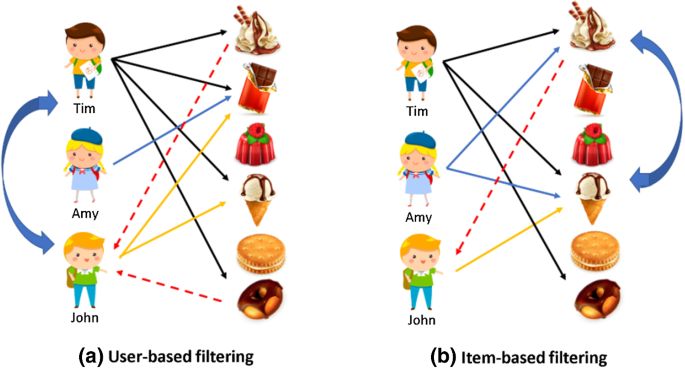

# Section 01_ 추천 시스템 소개

## contents📑

* 1_ 추천시스템 소개 [👉](#1)
* 2_ 주요 추천 알고리즘 [👉](#2)

## 1_ 추천시스템 소개[📑](#contents)

* 추천시스템 : 사용자의 과거 행동 데이터를 바탕으로 사용자에게 필요한 정보나 제품을 제시하는 시스템

  |             과거              |                   현재                    |
  | :---------------------------: | :---------------------------------------: |
  | 집단별로 묶어서 추천을 제공함 | 지금은 개개인들에게 맞춰서 추천을 제공함. |

* 추천 시스템의 여러 기술

  * 협업필터링
  * 내용 기반 필터링
  * 지식 기반 필터링
  * 딥러닝
  * 하이브리드 필터링(협업필터링 & 딥러닝)

## 2_ 주요 추천 알고리즘[📑](#contents)

* 협업 필터링

  : 구매 및 소비한 제품에 대한 소비자의 평가 패턴이 비슷한 집단 속에서 서로 접하지 않은 제품을 추천하는 기술

  

  > 추천시스템 도식화 예시

  * 한계 : 오랫동안 데이터가 쌓이지 않은 경우에는 구현이 어려움
    즉, 소비자들의 평가정보를 얻기가 어려움
  * 해결책 : 실제로 구매하는 것이 아니라 단순한 클릭, 체류 시간등을 데이터화 하는 것으로 대체함.

