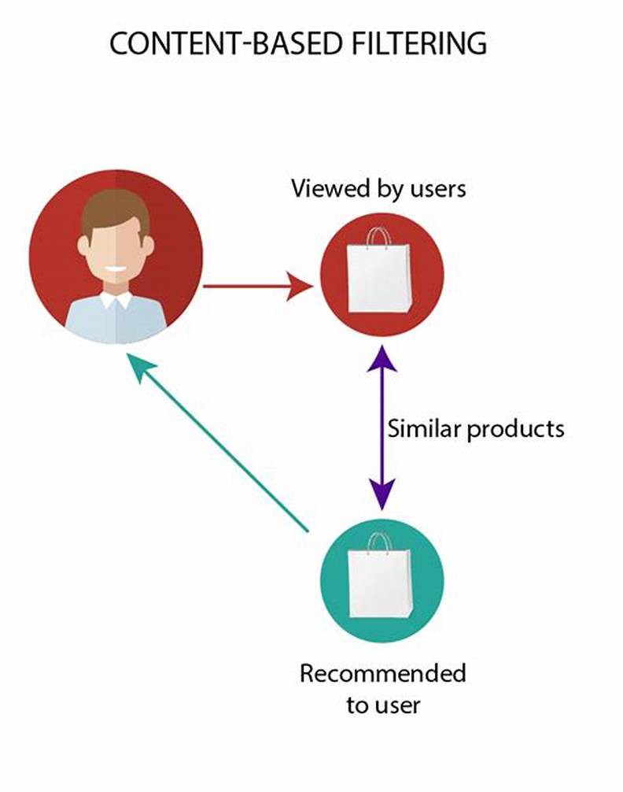
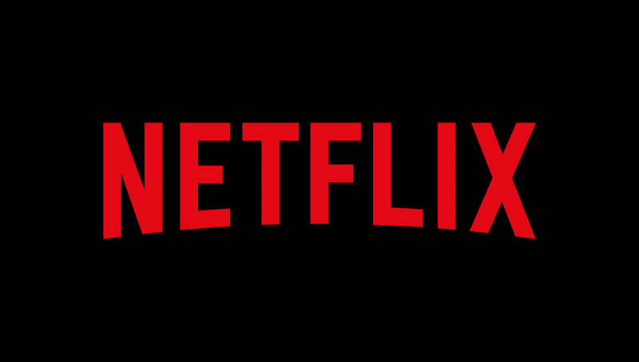

# Section 01_ 추천 시스템 소개

## contents📑

* 1_ 추천시스템 소개 [👉](#1)
  * 1_2_ 주요 추천 알고리즘 [👉](#1_2)
* 2_ 추천시스템 적용 사례 [👉](#2)

## 1_ 추천시스템 소개[📑](#contents)

* 추천시스템 : 사용자의 과거 행동 데이터를 바탕으로 사용자에게 필요한 정보나 제품을 제시하는 시스템

  |             과거              |                   현재                    |
  | :---------------------------: | :---------------------------------------: |
  | 집단별로 묶어서 추천을 제공함 | 지금은 개개인들에게 맞춰서 추천을 제공함. |

* 추천 시스템의 여러 기술

  * 협업필터링
  * 내용 기반 필터링
  * 지식 기반 필터링
  * 딥러닝
  * 하이브리드 필터링(협업필터링 & 딥러닝)

### 1_2 주요 추천 알고리즘[📑](#contents)

* 협업 필터링(Collaborative Filtering : CF)

  : 구매 및 소비한 제품에 대한 소비자의 평가 패턴이 비슷한 집단 속에서 서로 접하지 않은 제품을 추천하는 기술

  

  > 추천시스템 도식화 예시

  * 한계 : 오랫동안 데이터가 쌓이지 않은 경우에는 구현이 어려움
    즉, 소비자들의 평가정보를 얻기가 어려움
  * 해결책 : 실제로 구매하는 것이 아니라 단순한 클릭, 체류 시간등을 데이터화 하는 것으로 대체함.

* 내용 기반 필터링(Content-Based Filtering :CB)
  : 제품의 내용을 분석해서 추천하는 기술
  

* 지식 기반 필터링(Knowledge-Based Filtering : KB)
  : 특정 분야의 전문가의 도움을 받아서 그 분야에 대한 **전체적인 지식 구조** 를 만들어서 활용하는 방법

  * 장점 : 지식 기반 추천이기때문에 왜 이것을 추천하는지 설명을 해줌. 
  * 온톨로지(Ontology) : 체계도 기반으로 설명
  * 단점 : 각 분야마다 전문가가 필요함...!

* 딥러닝(Deep Learning : DL) 추천 기술
  : AI 알고리즘 중에 현재 가장 많이 사용되는 딥러닝 방법 사용

* 하이브리드(Hybrid)기술
  : 두 가지 이상의 알고리즘 혼합을 통한 하이브리드 형태

  입력 → 협업필터링 → 
  입력 → 내용기반필터링  → 
  합쳐서 추천시스템을 만듦.

## 2_ 추천시스템 적용 사례[📑](#contents)

* 넷플릭스 사례

  

  * 왜 넷플릭스에게 추천이 중요한가?
    * 영화와 드라마의 감상에 부정적인 감정이 됨. 

* 아마존 사례

  

  * 협업 필터링 기반으로 제작된 추천 시스템
    * 지금은 하이브리드 추천기술을 사용 중임.
  * 사용자 정보에 대한 수집을 다방면으로 하고 있음.
    * 고객 구입 상품에 대한 평가 : 별점
    * 상품 페이지 방문 데이터
    * 상품 페이지 체류 시간
    * 쇼핑카트 분석 
  * 고객 선호도의 가중치를 오랫동안 연구해옴.
  * 아마존의 경우 제품이 무수히 많음.(넷플릭스보다 많음.)
  * 더 많은 고민이 필요함.

