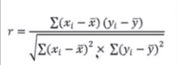
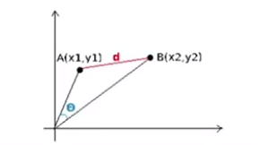
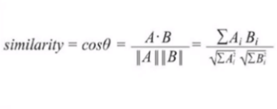
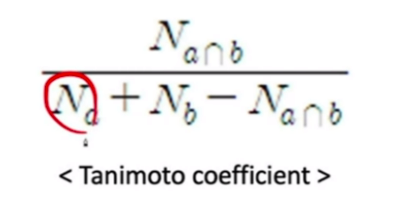
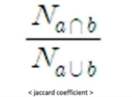

# 👍Section 03_ 협업 필터링 추천 시스템

## contents📑

* 0_ 들어가기 전에[✏️](#0)
* 1_ 데이터 읽기[✏️](#1)
* 2_ 인기제품 방식[✏️](#2)
* 3_ 추천 시스템의 정확도 측정[✏️](#3)
* 4_ 사용자 집단별 추천[✏️](#4)

## 0_ 들어가기 전에[📑](#contents)

* 협업 필터링(Collaborative Filtering: CF) : 어떤 아이템에 대해 **비슷한 취향** 을 가진 사람들은 **다른 아이템 또한** 비슷한 취향을 가질 것이다. 

## 1_ 협업 필터링의 원리

* 협업 필터링은 취향이 비슷한 사람들의 집단 존재 가정
  * `유사집단`의 취향을 `추천 대상`에게 추천

|                            | Movie 1 | Movie 2 | Movie 3 | Movie 4 | Movie 5 | Correlation with User 1 |
| -------------------------- | ------- | ------- | ------- | ------- | ------- | ----------------------- |
| User 1                     | 2       | 5       | 3       |         |         | -                       |
| User 2                     | 4       | 4       | 3       | 5       | 1       | 0.19                    |
| User 3                     | 1       | 5       | 4       |         | 5       | 0.89                    |
| User 4                     | 3       | 5       | 3       | 2       | 5       | 0.94                    |
| User5                      | 4       | 5       | 3       | 4       |         | 0.65                    |
| Average of User 3 & User 4 | 2       | 5       | 3.5     | 2       | 5       |                         |

> 1. 각 사용자의 유사성을 계산함. 
> 2. User 1과 가장 유사한 User 3, User 4
> 3. User 1이 보지 않은 movie 4, 5에 대해서 평가를 매겨야 함.
> 4. 평점 평균이 높은 movie5 를 User1에게 추천

## 2_ 유사도 지표

1. 상관계수

   

   * 가장 이해하기 쉬운 유사도
   * -1 ~ 1 사이 값

2. 코사인 유사도

   

   

   * 협업 필터링에서 가장 널리 쓰이는 유사도
   * 각 아이템 → 하나의 차원, 사용자의 평가값 → 좌표값
   * 두 사용자의 평가값 유사  → theta는 작아지고, 코사인 값은 커짐
   * -1 ~ 1 사이의 값
   * 데이터 이진값(binary)  → 타니모토 계수(tanimoto coefficient) 사용 권장

   > 
   >
   > * 타니모토 계수(tanimoto coefficient)

3. 자카드 계수

   

   * 타니모토 계수의 변형 → 자카드 계수
   * 이진수 데이터 → 좋은 결과

## 3_ 기본 CF 알고리즘

