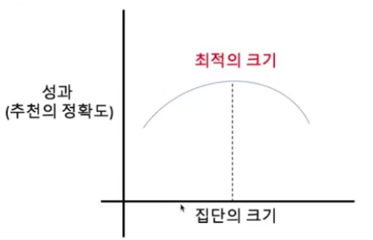

# 👍Section 03_ 협업 필터링 추천 시스템

## contents📑<a id='contents'></a>

* 0_ 들어가기 전에[✏️](#0)
* 1_ 데이터 읽기[✏️](#1)
* 2_ 인기제품 방식[✏️](#2)
* 3_ 추천 시스템의 정확도 측정[✏️](#3)
* 4_ 사용자 집단별 추천[✏️](#4)

## 0_ 들어가기 전에[📑](#contents)<a id='0'></a>

* 협업 필터링(Collaborative Filtering: CF) : 어떤 아이템에 대해 **비슷한 취향** 을 가진 사람들은 **다른 아이템 또한** 비슷한 취향을 가질 것이다. 

## 1_ 협업 필터링의 원리

* 협업 필터링은 취향이 비슷한 사람들의 집단 존재 가정
  * `유사집단`의 취향을 `추천 대상`에게 추천

|                            | Movie 1 | Movie 2 | Movie 3 | Movie 4 | Movie 5 | Correlation with User 1 |
| -------------------------- | ------- | ------- | ------- | ------- | ------- | ----------------------- |
| User 1                     | 2       | 5       | 3       |         |         | -                       |
| User 2                     | 4       | 4       | 3       | 5       | 1       | 0.19                    |
| User 3                     | 1       | 5       | 4       |         | 5       | 0.89                    |
| User 4                     | 3       | 5       | 3       | 2       | 5       | 0.94                    |
| User5                      | 4       | 5       | 3       | 4       |         | 0.65                    |
| Average of User 3 & User 4 | 2       | 5       | 3.5     | 2       | 5       |                         |

> 1. 각 사용자의 유사성을 계산함. 
> 2. User 1과 가장 유사한 User 3, User 4
> 3. User 1이 보지 않은 movie 4, 5에 대해서 평가를 매겨야 함.
> 4. 평점 평균이 높은 movie5 를 User1에게 추천

## 2_ 유사도 지표

1. 상관계수

   

   * 가장 이해하기 쉬운 유사도
   * -1 ~ 1 사이 값

2. 코사인 유사도

   

   

   * 협업 필터링에서 가장 널리 쓰이는 유사도
   * 각 아이템 → 하나의 차원, 사용자의 평가값 → 좌표값
   * 두 사용자의 평가값 유사  → theta는 작아지고, 코사인 값은 커짐
   * -1 ~ 1 사이의 값
   * 데이터 이진값(binary)  → 타니모토 계수(tanimoto coefficient) 사용 권장

   > 
   >
   > * 타니모토 계수(tanimoto coefficient)

3. 자카드 계수

   

   * 타니모토 계수의 변형 → 자카드 계수
   * 이진수 데이터 → 좋은 결과

## 3_ 기본 CF 알고리즘

|               1단계               |                 2단계                 |                            3단계                             |                    4단계                     |
| :-------------------------------: | :-----------------------------------: | :----------------------------------------------------------: | :------------------------------------------: |
| 모든 사용자 간 평가의 유사도 계산 | 추천 대상과 다른 사용자간 유사도 추출 | 추천 대상이 평가하지 않는 아이템에 대한 예상 평가값 계산<br />평가값 = 다른 사용자 평가 * 다른 사용자 유사도 | 아이템 중에서 예상 평가값 가장 높은 N개 추천 |

* 코사인 유사도 ` user similarity` 확인

  ```python
  from sklearn.metrics.pairwise import cosine_similarity
  matrix_dummy = ratings_matrix.copy().fillna(0)
  user_similarity = cosine_similarity(matrix_dummy, matrix_dummy)
  pd.DataFrame(user_similarity)
  
  # 실행 결과
  	0	1	2	3	4	5	6	7	8	9	...	933	934	935	936	937	938	939	940	941	942
  0	1.000000	0.155444	0.018091	0.037327	0.312866	0.284093	0.314349	0.222513	0.061672	0.259640	...	0.277484	0.100635	0.217765	0.158706	0.191710	0.122333	0.268500	0.090656	0.117199	0.300281
  1	0.155444	1.000000	0.092771	0.155143	0.073775	0.164682	0.089138	0.105211	0.039402	0.129152	...	0.120233	0.257595	0.294916	0.263524	0.254662	0.223836	0.155516	0.162992	0.146779	0.084631
  2	0.018091	0.092771	1.000000	0.286608	0.000000	0.075458	0.075167	0.063237	0.023599	0.034582	...	0.024609	0.000000	0.127619	0.033076	0.115424	0.036505	0.089818	0.026124	0.075625	0.016051
  3	0.037327	0.155143	0.286608	1.000000	0.040745	0.078150	0.091273	0.197772	0.057661	0.080271	...	0.068545	0.047433	0.126053	0.080815	0.088510	0.000000	0.156057	0.063831	0.091585	0.078438
  4	0.312866	0.073775	0.000000	0.040745	1.000000	0.207036	0.303716	0.177732	0.034706	0.143567	...	0.285905	0.038067	0.075206	0.075666	0.112294	0.028831	0.187536	0.137671	0.084622	0.264256
  ...	...	...	...	...	...	...	...	...	...	...	...	...	...	...	...	...	...	...	...	...	...
  938	0.122333	0.223836	0.036505	0.000000	0.028831	0.085675	0.072986	0.065599	0.051001	0.067263	...	0.057012	0.342350	0.210314	0.240177	0.302099	1.000000	0.023006	0.182925	0.018191	0.066604
  939	0.268500	0.155516	0.089818	0.156057	0.187536	0.270205	0.218335	0.163793	0.095369	0.261729	...	0.237978	0.050925	0.102415	0.068787	0.096689	0.023006	1.000000	0.098165	0.151992	0.145666
  940	0.090656	0.162992	0.026124	0.063831	0.137671	0.115379	0.053265	0.124405	0.082122	0.063780	...	0.021922	0.151324	0.190489	0.174950	0.207626	0.182925	0.098165	1.000000	0.102520	0.070007
  941	0.117199	0.146779	0.075625	0.091585	0.084622	0.245607	0.217934	0.121717	0.019845	0.125410	...	0.176588	0.096589	0.054800	0.086533	0.070681	0.018191	0.151992	0.102520	1.000000	0.131230
  942	0.300281	0.084631	0.016051	0.078438	0.264256	0.226032	0.304070	0.193257	0.026911	0.187314	...	0.186892	0.136145	0.107752	0.025145	0.170094	0.066604	0.145666	0.070007	0.131230	1.000000
  943 rows × 943 columns
  ```

* 좀더 명확하게 보는 코드

  ```python
  ##### 코사인 유사도 계산 #####
  from sklearn.metrics.pairwise import cosine_similarity
  matrix_dummy = ratings_matrix.copy().fillna(0)
  user_similarity = cosine_similarity(matrix_dummy, matrix_dummy)
  # pd.DataFrame(user_similarity)
  user_similarity = pd.DataFrame(user_similarity,
                                  index=ratings_matrix.index,
                                  columns=ratings_matrix.index)
  
  user_similarity
  # 실행 결과
  user_id	1	2	3	4	5	6	7	8	9	10	...	934	935	936	937	938	939	940	941	942	943
  user_id																					
  1	1.000000	0.167475	0.020191	0.039798	0.297028	0.316073	0.351824	0.186010	0.072262	0.266069	...	0.270688	0.110942	0.221324	0.200087	0.182838	0.084611	0.305987	0.125474	0.142787	0.309173
  2	0.167475	1.000000	0.049921	0.136059	0.054034	0.199332	0.098998	0.097644	0.149016	0.142020	...	0.134538	0.287440	0.278580	0.414659	0.245380	0.226573	0.228027	0.140147	0.120413	0.095338
  3	0.020191	0.049921	1.000000	0.331186	0.000000	0.084230	0.040335	0.073655	0.079531	0.044186	...	0.009252	0.000000	0.080859	0.077540	0.079100	0.000000	0.085910	0.046812	0.153801	0.000000
  4	0.039798	0.136059	0.331186	1.000000	0.013009	0.027840	0.063617	0.129836	0.000000	0.000000	...	0.014678	0.000000	0.104229	0.177691	0.117125	0.000000	0.069387	0.136157	0.130458	0.036406
  5	0.297028	0.054034	0.000000	0.013009	1.000000	0.163537	0.304846	0.205443	0.044580	0.130982	...	0.282285	0.012708	0.050599	0.033572	0.082193	0.045358	0.212185	0.069671	0.177189	0.244168
  ...	...	...	...	...	...	...	...	...	...	...	...	...	...	...	...	...	...	...	...	...	...
  939	0.084611	0.226573	0.000000	0.000000	0.045358	0.081536	0.068369	0.097502	0.000000	0.048143	...	0.037531	0.349827	0.090386	0.209692	0.341866	1.000000	0.069122	0.153208	0.039309	0.092480
  940	0.305987	0.228027	0.085910	0.069387	0.212185	0.293066	0.264376	0.197424	0.133528	0.246606	...	0.295447	0.039216	0.125821	0.198247	0.132105	0.069122	1.000000	0.039815	0.206281	0.161205
  941	0.125474	0.140147	0.046812	0.136157	0.069671	0.126866	0.075428	0.164109	0.000000	0.070974	...	0.040198	0.171394	0.218108	0.155721	0.331758	0.153208	0.039815	1.000000	0.035286	0.085458
  942	0.142787	0.120413	0.153801	0.130458	0.177189	0.274914	0.266272	0.185634	0.090780	0.223458	...	0.184115	0.000000	0.067045	0.126248	0.079181	0.039309	0.206281	0.035286	1.000000	0.122316
  943	0.309173	0.095338	0.000000	0.036406	0.244168	0.185030	0.306245	0.227087	0.038717	0.149595	...	0.193110	0.171463	0.109478	0.057879	0.153257	0.092480	0.161205	0.085458	0.122316	1.000000
  943 rows × 943 columns
  ```

* `CF_simple` 함수 정의

  ```python
  #### 주어진 영화의 (movie_id) 가중 평균 rating을 계산하는 함수 ####
  def CF_simple(user_id, movie_id):
      if movie_id in ratings_matrix.columns:
          sim_scores = user_similarity[user_id].copy()
          movie_ratings = ratings_matrix[movie_id].copy()
          none_ratings_idx = movie_ratings[movie_ratings.isnull()].index
          movie_ratings = movie_ratings.dropna()
          sim_scores = sim_scores.drop(none_ratings_idx)
          mean_rating = np.dot(sim_scores, movie_ratings) / sim_scores.sum()
  
      else:
          mean_rating = 3.0
      return mean_rating
  ```

* 정확도 계산

  ```python
  #### 정확도 계산 ####
  score(CF_simple)
  
  # 실행 결과
  1.0169396412312266
  ```

  

## 4_ 이웃을 고려한 CF

* 단순 CF 알고리즘 개선 방법 → `KNN 방법` , `Thresholding 방법`

  * KNN 방법 : 놓은 유사도를 가진 것들끼리 상위K를 정함.
  * Thresholding 방법 : 미리 몇퍼센트를 정해두고 그 기준을 충족시키는 것을 집단으로 묶음.

* CF_knn

  ```python
  def CF_knn(user_id, movie_id, neighbor_size=0):
      if movie_id in ratings_matrix.columns:
          sim_scores = user_similarity[user_id].copy()
          movie_ratings = ratings_matrix[movie_id].copy()
          none_rating_idx = movie_ratings[movie_ratings.isnull()].index
          movie_ratings = movie_ratings.dropna()
          sim_scores = sim_scores.drop(none_rating_idx)
  
          if neighbor_size == 0:
              mean_rating = np.dot(sim_scores, movie_ratings) / sim_scores.sum()
          else:
              if len(sim_scores) > 1:
                  neighbor_size = min(neighbor_size, len(sim_scores))
                  sim_scores = np.array(sim_scores)
                  movie_ratings = np.array(movie_ratings)
                  user_idx = np.argsort(sim_scores)
                  sim_scores = sim_scores[user_idx][-neighbor_size:]
                  movie_ratings = movie_ratings[user_idx][-neighbor_size:]
                  mean_rating = np.dot(sim_scores, movie_ratings) / sim_scores.sum()
              else:
                  mean_rating = 3.0
      else:
          mean_rating = 3.0
      return mean_rating
  
  # 정확도 계산
  score(CF_knn, neighbor_size=30)
  
  # 실행 결과
  1.0108871337570486
  ```

  * 약간 개선됨을 알수 있음.

* 영화를 추천

  ```python
  #### 실제 주어진 사용자에 대해 추천을 받는 기능 구현 ####
  ratings_matrix = x_train.pivot(index='user_id',
                                   columns='movie_id',
                                   values='rating')
  
  matrix_dummy = ratings_matrix.copy().fillna(0)
  user_similarity = cosine_similarity(matrix_dummy, matrix_dummy)
  user_similarity = pd.DataFrame(user_similarity,
                                  index=ratings_matrix.index,
                                  columns=ratings_matrix.index)
  def recom_movie(user_id, n_items, neighbor_size=30):
      user_movie = ratings_matrix.loc[user_id].copy()
      for movie in ratings_matrix.columns:
          if pd.notnull(user_movie.loc[movie]):
              user_movie.loc[movie] = 0
  
          else:
              user_movie.loc[movie] = CF_knn(user_id, movie, neighbor_size)
  
  
      movie_sort = user_movie.sort_values(ascending=False)[:n_items]
      recom_movies = movies.loc[movie_sort.index]
      recommendations = recom_movies['title']
      return recommendations
  
  recom_movie(user_id=729, n_items=5, neighbor_size=30)
  
  # 실행 결과
  <ipython-input-3-c5813698dafe>:92: RuntimeWarning: invalid value encountered in double_scalars
    mean_rating = np.dot(sim_scores, movie_ratings) / sim_scores.sum()
  movie_id
  1293                         Star Kid (1997)
  1467    Saint of Fort Washington, The (1993)
  1189                      Prefontaine (1997)
  1491                 Tough and Deadly (1995)
  1466                Margaret's Museum (1995)
  Name: title, dtype: object
  ```

## 5_ 최적의 이웃 크기 결정



* `overfitting`을 막기 위해 최적의 조건을 찾아야 함.

```python
import os
import pandas as pd
import numpy as np
from sklearn.model_selection import train_test_split

##### 데이터 불러오기 및 데이터셋 만들기 #####
base_src = './Data'
u_user_src = os.path.join(base_src, 'u.user')
u_cols = ['user_id', 'age', 'sex', 'occupation', 'zip_code']
users = pd.read_csv(u_user_src,
                    sep = '|',
                    names = u_cols,
                    encoding='latin-1')
users = users.set_index('user_id')

u_item_src = os.path.join(base_src, 'u.item')
i_cols = ['movie_id', 'title','release date', 'video release date',
            'IMDB URL', 'unknown', 'Action','Adventure','Animation',
            'Children\'s', 'Comedy', 'Crime','Documentary','Drama','Fantasy',
            'Film-Noir','Horror','Musical','Mystery','Romance','Sci-Fi','Thriller','War','Western']
movies = pd.read_csv(u_item_src,
                    sep='|',
                    names=i_cols,
                    encoding='latin-1')
movies = movies.set_index('movie_id')

u_data_src = os.path.join(base_src, 'u.data')
r_cols = ['user_id', 'movie_id', 'rating', 'timestamp']
ratings = pd.read_csv(u_data_src,
                        sep='\t',
                        names=r_cols,
                        encoding='latin-1')

# RMSE 함수
def RMSE(y_true, y_pred):
    return np.sqrt(np.mean((np.array(y_true)-np.array(y_pred))**2))

# score(RMSE) 계산
def score(model, neighbor_size=0):      # neighbor_size 지정 
    # 테스트 데이터의 user_id와 movie_id간 pair를 맞춰 튜플형 원소 리스트데이터를 만듦.
    id_pairs = zip(x_test['user_id'], x_test['movie_id'])
    # 모든 사용자-영화 짝에서 대해서 주어진 예측 모델에 의해 예측값 계산 및 리스트형 데이터 생성
    y_pred = np.array([model(user, movie, neighbor_size) for (user, movie) in id_pairs])
    # 실제 평점값
    y_true = np.array(x_test['rating'])
    return RMSE(y_true, y_pred)

x = ratings.copy()
y = ratings['user_id']

x_train, x_test, y_train, y_test = train_test_split(x, y, test_size=0.25, stratify=y)

########################################################################################

ratings_matrix = x_train.pivot(index='user_id', columns='movie_id', values='rating')

from sklearn.metrics.pairwise import cosine_similarity
matrix_dummy = ratings_matrix.copy().fillna(0)
user_similarity = cosine_similarity(matrix_dummy, matrix_dummy)
user_similarity = pd.DataFrame(user_similarity,
                                index=ratings_matrix.index,
                                columns=ratings_matrix.index)

def CF_knn(user_id, movie_id, neighbor_size=0):
    # train/test set의 분할에 따라 rating_matrix에 영화가 있는지 확인
    if movie_id in ratings_matrix.columns:
        # 주어진 사용자(user_id)와 다른 사용자의 유사도 추출
        sim_scores = user_similarity[user_id].copy()
        # 주어진 영화(movie_id)와 다른 사용자의 유사도 추출
        movie_ratings = ratings_matrix[movie_id].copy()
        # 주어진 영화에 대해서 평가를 하지 않은 사용자를 가중평균계상에서 제외하기 위해 인덱스 추출
        none_rating_idx = movie_ratings[movie_ratings.isnull()].index
        # 주어진 영화에 대해서 평가를 하지 않은 사람 제외
        movie_ratings = movie_ratings.dropna()
        # 주어진 영화를 평가하지 않은 사용자와의 유사도를 제거, 가중 평균 계산할때 필요가 없기 때문
        sim_scores = sim_scores.drop(none_rating_idx)


        #### Neighbot size가 지정되지 않은 경우 ####
        if neighbor_size == 0:
            mean_rating = np.dot(sim_scores, movie_ratings) / sim_scores.sum()
        #### Neighbot size가 지정된 경우 ####
        else:
            if len(sim_scores) > 1:
                neighbor_size = min(neighbor_size, len(sim_scores))
                sim_scores = np.array(sim_scores)
                movie_ratings = np.array(movie_ratings)
                user_idx = np.argsort(sim_scores)
                sim_scores = sim_scores[user_idx][-neighbor_size:]
                movie_ratings = movie_ratings[user_idx][-neighbor_size:]
                mean_rating = np.dot(sim_scores, movie_ratings) / sim_scores.sum()
            else:
                mean_rating = 3.0
    # train/test set의 분할에 따라 rating_matrix에 해당 영화가 없으면 기본값 3.0예측치로 간주
    else:
        mean_rating = 3.0
    return mean_rating
# neighbor_size가 10, 20, 30, 40, 50, 60인 경우에 대해서 RMSE를 계산하고 이를 출력한다.
for neighbor_size in [10,20,30,40,50,60]:
    print('Neighbor Size = %d : RMSE = %.4f'%(neighbor_size, score(CF_knn, neighbor_size)))

# 실행 결과
Neighbor Size = 10 : RMSE = 1.0314
Neighbor Size = 20 : RMSE = 1.0165
Neighbor Size = 30 : RMSE = 1.0128
Neighbor Size = 40 : RMSE = 1.0124
Neighbor Size = 50 : RMSE = 1.0128
Neighbor Size = 60 : RMSE = 1.0137
```

