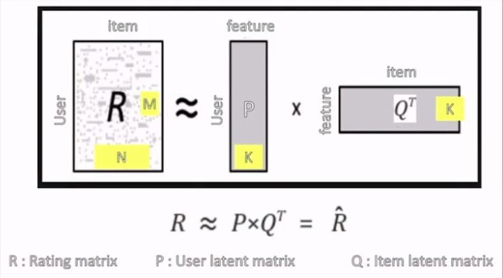
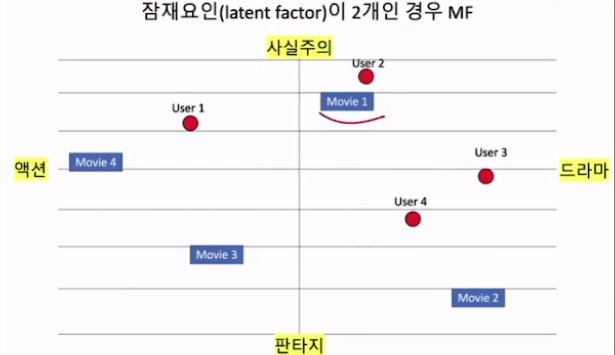
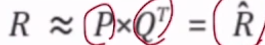
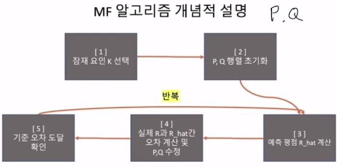
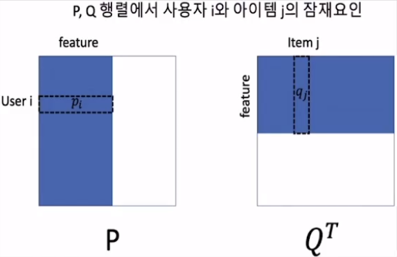
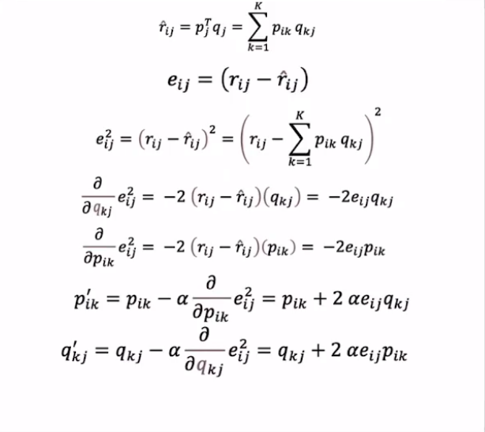
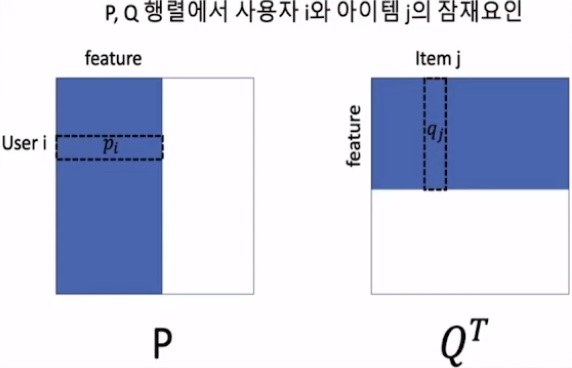
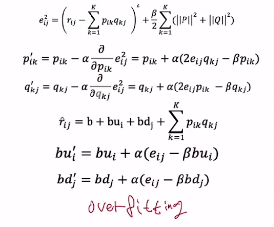

# 👍Section 04_ Matrix Factorization(MF) 기반 추천[↩](../../)

## contents📑

* 0_ 들어가기 전에[✏️](#0)
* 1_ Matrix Factorization(MF)방식의 원리[✏️](#1)
* 2_ SQD(Stichastic Gradient Decent)를 사용한 MF 알고리즘[✏️](#2)

## 0_ 들어가기 전에[📑](#contents)

|      | 메모리 기반 알고리즘                          | 모델 기반 알고리즘                                   |
| ---- | --------------------------------------------- | ---------------------------------------------------- |
| 설명 | 메모리에 있는 데이터를 계산해서 추천하는 방식 | 데이터로부터 미리 모델을 구성후 필요시 추천하는 방식 |
| 특징 | 개별 사용자 데이터 집중                       | 전체 사용자 패턴 집중                                |
| 장점 | 원래 데이터에 충실하게 사용                   | 대규모 데이터에 빠르게 반응                          |
| 단점 | 대규모 데이터에 느리게 반응                   | 모델 생성 과정 오래 걸림                             |

## 1_ Matrix Factorization(MF)방식의 원리[📑](#contents)

* R = N *M

* P = M * K

* QT = N *K

* 사용자와 아이템의 특성을 k개의 잠재 요인을 사용해서 분석하는 모델

* 예시

  |        | 액션 - 드라마 (-1~1) | 판타지-사실주의 (-1~1) |
  | :----: | :-----------------------: | :-------------------------: |
  | User 1 |           -0.43           |            0.21             |
  | User 2 |           0.31            |            0.92             |
  | User 3 |           0.69            |            -0.03            |
  | User 4 |           0.49            |            -0.3             |

* 아이템 요인에 대해서 해석 가능

  |         | 액션 - 드라마 (-1~1) | 판타지-사실주의 (-1~1) |
  | ------- | ------------------------- | --------------------------- |
  | Movie 1 | 0.31                      | 0.6                         |
  | Movie 2 | 0.61                      | -0.82                       |
  | Movie 3 | -0.38                     | -0.61                       |
  | Movie 4 | -0.79                     | 0.08                        |

* 2차원 공간에 배치하면

  

* 사용자의 영화별 예측 평점

  * 

  |        | Movie 1 | Movie 2 | Movie 3 | Movie 4 |
  | ------ | ------- | ------- | ------- | ------- |
  | User 1 | -0.0073 | -0.4345 | 0.0353  | 0.3565  |
  | User 2 | 0.6481  | -0.5653 | -0.679  | -0.1713 |
  | User 3 | 0.1959  | 0.4455  | -0.2439 | -0.5475 |
  | User 4 | -0.0374 | 0.5266  | 0.0082  | -0.3874 |

## 2_ SQD(Stichastic Gradient Decent)를 사용한 MF 알고리즘[📑](#contents)

* 예상값

* 예측 오차
* 예측오차의 제곱을 하고 p와 q에 대해서 편미분을 함.
* 다시 활용을 해서 p, q를 업데이트함. 
* 알파는 얼만큼의 가중치를 둘 것인지?

* 오버피팅을 어떻게 줄이는가?
  * 정규화 행을 어떻게 줄이는가?
  * weight만 주게 되면 너무 잘 
