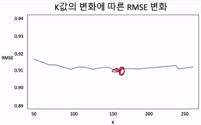
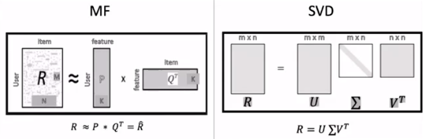

# 👍Section 04_ Matrix Factorization(MF) 기반 추천[↩](../../)

## contents📑<a id='contents'></a>

* 0_ 들어가기 전에[✏️](#0)
* 1_ Matrix Factorization(MF)방식의 원리[✏️](#1)
* 2_ SGD(Stichastic Gradient Decent)를 사용한 MF 알고리즘[✏️](#2)
* 3_ SGD를 사용한 MF 기본 알고리즘[✏️](#3)
* 4_ train/test 분리 MF 알고리즘[✏️](#4)
* 5_ MF의 최적 파라미터 찾기[✏️](#5)
* 6_ MF와 SVD[✏️](#6)

## 0_ 들어가기 전에[📑](#contents)<a id='0'></a>

|      | 메모리 기반 알고리즘                          | 모델 기반 알고리즘                                   |
| ---- | --------------------------------------------- | ---------------------------------------------------- |
| 설명 | 메모리에 있는 데이터를 계산해서 추천하는 방식 | 데이터로부터 미리 모델을 구성후 필요시 추천하는 방식 |
| 특징 | 개별 사용자 데이터 집중                       | 전체 사용자 패턴 집중                                |
| 장점 | 원래 데이터에 충실하게 사용                   | 대규모 데이터에 빠르게 반응                          |
| 단점 | 대규모 데이터에 느리게 반응                   | 모델 생성 과정 오래 걸림                             |

## 1_ Matrix Factorization(MF)방식의 원리[📑](#contents)<a id='1'></a>


* R = N *M

* P = M * K

* Q<sup>T</sup> = N *K

* 사용자와 아이템의 특성을 k개의 잠재 요인을 사용해서 분석하는 모델

* 예시

  |        | 액션 - 드라마<br />(-1~1) | 판타지-사실주의<br />(-1~1) |
  | :----: | :-----------------------: | :-------------------------: |
  | User 1 |           -0.43           |            0.21             |
  | User 2 |           0.31            |            0.92             |
  | User 3 |           0.69            |            -0.03            |
  | User 4 |           0.49            |            -0.3             |

* 아이템 요인에 대해서 해석 가능

  |         | 액션 - 드라마<br />(-1~1) | 판타지-사실주의<br />(-1~1) |
  | ------- | ------------------------- | --------------------------- |
  | Movie 1 | 0.31                      | 0.6                         |
  | Movie 2 | 0.61                      | -0.82                       |
  | Movie 3 | -0.38                     | -0.61                       |
  | Movie 4 | -0.79                     | 0.08                        |

* 2차원 공간에 배치하면

  

* 사용자의 영화별 예측 평점

  * 

  |        | Movie 1 | Movie 2 | Movie 3 | Movie 4 |
  | ------ | ------- | ------- | ------- | ------- |
  | User 1 | -0.0073 | -0.4345 | 0.0353  | 0.3565  |
  | User 2 | 0.6481  | -0.5653 | -0.679  | -0.1713 |
  | User 3 | 0.1959  | 0.4455  | -0.2439 | -0.5475 |
  | User 4 | -0.0374 | 0.5266  | 0.0082  | -0.3874 |

## 2_ SQD(Stichastic Gradient Decent)를 사용한 MF 알고리즘[📑](#contents)<a id='2'></a>


* 예상값

* 예측 오차
* 예측오차의 제곱을 하고 p와 q에 대해서 편미분을 함.
* 다시 활용을 해서 p, q를 업데이트함. 
* 알파는 얼만큼의 가중치를 둘 것인지?


* 오버피팅을 어떻게 줄이는가?
  * 정규화 행을 어떻게 줄이는가?
  * weight만 주게 되면 너무 잘 

## 3_ SGD를 사용한 MF 기본 알고리즘[📑](#contents)<a id='3'></a>

* 세팅

  ```python
  import os
  import numpy as np
  import pandas as pd
  
  base_src =  './Data'
  u_data_src = os.path.join(base_src, 'u.data')
  r_cols = ['user_id', 'movie_id', 'rating', 'timestamp']
  ratings = pd.read_csv(u_data_src,
                          sep='\t',
                          names=r_cols,
                          encoding='latin-1')
  
  # timestamp 제거
  ratings = ratings[['user_id', 'movie_id', 'rating']].astype(int)
  ```

* 구현

  ```python
  class MF():
      def __init__(self, ratings, hyper_params):
          self.R = np.array(ratings)
          self.num_users, self.num_items = np.shape(self.R)
          self.K = hyper_params['K']
          self.alpha = hyper_params['alpha']
          self.beta = hyper_params['beta']
          self.iterations = hyper_params['iterations']
          self.verbose = hyper_params['verbose']
  
      def rmse(self):
          xs, ys = self.R.nonzero()
          self.predictions = []
          self.errors = []
  
          for x, y in zip(xs, ys):
              prediction = self.get_prediction(x, y)
              self.predictions.append(prediction)
              self.errors.append(self.R[x, y] - prediction)
          self.predictions = np.array(self.predictions)
          self.errors = np.array(self.errors)
  
          return np.sqrt(np.mean(self.errors**2))
  
      def train(self):
          self.P = np.random.normal(scale=1./self.K,                  # scale = 표준편차를 이야기함
                                      size=(self.num_users, self.K))  # size 실제 유저수와 잠재요인의 갯수 = 크기 값
          self.Q = np.random.normal(scale=1./self.K,
                                      size = (self.num_items, self.K))
  
          self.b_u = np.zeros(self.num_users)
          self.b_d = np.zeros(self.num_items)
          self.b = np.mean(self.R[self.R.nonzero()])
  
          rows, columns = self.R.nonzero()
          self.samples = [(i, j, self.R[i, j]) for i, j in zip(rows, columns)]
  
          training_process = []
          for i in range(self.iterations):
              np.random.shuffle(self.samples)
              self.sgd()
              rmse = self.rmse()
              training_process.append((i+1, rmse)) # 몇번 째의 RMSE인지?
              if self.verbose:
                  if (i+1) % 10 == 0:
                      print('Iteration : %d ; train RMSE = %.4f'%(i + 1, rmse))
          return training_process
  
      def get_prediction(self, i, j):
          prediction = self.b + self.b_u[i] +self.b_d[j] + self.P[i, :].dot(self.Q[j,].T)
          return prediction
      def sgd(self):
          for i, j, r in self.samples:
              prediction = self.get_prediction(i, j)
              e = (r-prediction)
  
              self.b_u[i] += self.alpha * (e - (self.beta * self.b_u[i]))
              self.b_d[j] += self.alpha * (e - (self.beta * self.b_d[j]))
  
              self.P[i,:] += self.alpha * ((e * self.Q[j,:] - (self.beta * self.P[i, :])))
              self.Q[j,:] += self.alpha * ((e * self.Q[i,:] - (self.beta * self.Q[j, :])))
  
  R_temp = ratings.pivot(index='user_id',\
                          columns='movie_id',
                          values='rating').fillna(0)
  
  hyper_params = {
      'K' : 30,
      'alpha' : 0.001,
      'beta' : 0.02,
      'iterations' :100,
      'verbose' : True
  }
  
  mf = MF(R_temp, hyper_params)
  
  train_process = mf.train()
  
  # 실행 결과
  Iteration : 10 ; train RMSE = 0.9588
  Iteration : 20 ; train RMSE = 0.9380
  Iteration : 30 ; train RMSE = 0.9291
  Iteration : 40 ; train RMSE = 0.9241
  Iteration : 50 ; train RMSE = 0.9208
  Iteration : 60 ; train RMSE = 0.9185
  Iteration : 70 ; train RMSE = 0.9166
  Iteration : 80 ; train RMSE = 0.9150
  Iteration : 90 ; train RMSE = 0.9135
  Iteration : 100 ; train RMSE = 0.9120
  ```

  

## 4_ train/test 분리 MF 알고리즘[📑](#contents)<a id='4'></a>

* 구현

  ```python
  import os
  import numpy as np
  import pandas as pd
  
  base_src =  './Data'
  u_data_src = os.path.join(base_src, 'u.data')
  r_cols = ['user_id', 'movie_id', 'rating', 'timestamp']
  ratings = pd.read_csv(u_data_src,
                          sep='\t',
                          names=r_cols,
                          encoding='latin-1')
  
  # timestamp 제거
  ratings = ratings[['user_id', 'movie_id', 'rating']].astype(int)
  
  # train / test set 분리
  from sklearn.utils import shuffle
  TRAIN_SIZE = 0.75
  
  # (사용자 - 영화 - 평점)
  ratings = shuffle(ratings, random_state=2021)   # 모든 사람이 똑같은 raitings가 나오게 됨. 
  cutoff = int(TRAIN_SIZE * len(ratings))
  ratings_train = ratings.iloc[:cutoff]           # 어디까지 
  ratings_test = ratings.iloc[cutoff:]            # 어디 이후로 데이터를 뽑으면 될것 인지?
  
  class NEW_MF():
      def __init__(self, ratings, hyper_params):
          self.R = np.array(ratings)
          # 사용자 수 (num_users)와 아이템 수 (num_items)를 받아온다.
          self.num_users, self.num_items = np.shape(self.R)
          # 아래는 MF weight 조절을 위한 하이퍼 파라미더다.
          # K : 잠재요인(latent factor)의 수
          self.K = hyper_params['K']
          # alpha : 학습률
          self.alpha = hyper_params['alpha']
          # beta : 정규화 개수
          self.beta = hyper_params['beta']
          # iterations : SGD의 계산을 할 때 반복 횟수
          self.iterations = hyper_params['iterations']
          # verbose : SGD의 학습 과정을 중간중간에 출력할 것인지에 대한 여부
          self.verbose = hyper_params['verbose']
  
          # 지난 시간과 조금 다른 부분
          # movie_lens 데이터는 굉장히 잘 정리된 데이터 이지만, 현업의 데이터는 연속값이 아닐 수 있음. 
          # self.R을 numpy로 변환 시킬 경우 중간에 비어있는 실제 id 랑 self.R의 값과 매칭이 안됨.
          ### Item id에 관한 ###
          item_id_index = []
          index_item_id = []
          for i, one_id in enumerate(ratings):
              item_id_index.append([one_id, i])
              index_item_id.append([i, one_id])
          self.item_id_index = dict(item_id_index)    # 어떤 id 값이 들어오더라도 id 값과 numpy array와 매핑 시켜줌.
          self.index_item_id = dict(index_item_id)
  
          user_id_index = []
          index_user_id = []
          for i, one_id in enumerate(ratings.T):
              user_id_index.append([one_id, i])
              index_user_id.append([i, one_id])
          self.user_id_index = dict(user_id_index)
          self.index_user_id = dict(index_user_id)
  
  
      def rmse(self):
          # self.R에서 평점이 있는 (0이 아닌) 요소의 인덱스를 가져온다.
          xs, ys = self.R.nonzero()
          # prediction과 error를 담을 리스트 변수 초기화
          self.predictions = []
          self.errors = []
          # 평점이 있는 요소(사용자 x, 아이템 y) 각각에 대해서 아래의 코드를 실행한다.
          for x, y in zip(xs, ys):
              # 사용자 x, 아이템 y에 대해서 평점 예측치를 get_prediction()함수를 사용해서 계산한다.
              prediction = self.get_prediction(x, y)
              # 예측값을 예측값 리스트에 추가한다.
              self.predictions.append(prediction)
              # 실제값(R)과 예측값의 차이(errors) 계산해서 오차값 리스트에 추가한다.
              self.errors.append(self.R[x, y] - prediction)
          # 예측값 리스트와 오차값 리스트를 numpy array형태로 변환한다.
          self.predictions = np.array(self.predictions)
          self.errors = np.array(self.errors)
          # error를 활용해서 RMSE를 도출
          return np.sqrt(np.mean(self.errors**2))
  
      def sgd(self):
          for i, j, r in self.samples:
              # 사용자 i : 아이템 j에 대한 평점 예측치 계산
              prediction = self.get_prediction(i, j)
              # 실제 평점과 비교한 오차 계산
              e = (r - prediction)
              # 사용자 평가 경향 계산 및 업데이트
              self.b_u[i] += self.alpha * (e - self.beta * self.b_u[i])
              # 아이템 평가 경향 계산 및 업데이트
              self.b_d[j] += self.alpha * (e - self.beta * self.b_d[j])
              # P 행렬 계산 및 업데이트
              self.P[i, :] += self.alpha * (e * self.Q[j, :] - self.beta * self.P[i,:])
              # Q 행렬 계산 및 업데이트
              self.Q[j, :] += self.alpha * (e * self.P[i, :] - self.beta * self.Q[j,:])
      def get_prediction(self, i, j):
          # 사용자 i, 아이템 j에 대한 평점 예측치를 앞에서 배웠던 식을 이용해서 구한다.
          prediction = self.b + self.b_u[i] + self.b_d[j] + self.P[i, :].dot(self.Q[j, :].T)
          return prediction
  
      # Test set 선정
      def set_test(self, ratings_test):
          test_set = []
          for i in range(len(ratings_test)):      # test 데이터에 있는 각 데이터에 대해서
              x = self.user_id_index[ratings_test.iloc[i, 0]]
              y = self.item_id_index[ratings_test.iloc[i, 1]]
              z = ratings_test.iloc[i, 2]
              test_set.append([x, y, z])
              self.R[x, y] = 0                    # test set으로 지정한 것들은 모두 0으로
          self.test_set = test_set
          return test_set                   
  
  
      # Test set RMSE 계산
      def test_rmse(self):
          error = 0   # 0으로 초기화
          for one_set in self.test_set:
              predicted = self.get_prediction(one_set[0], one_set[1])
              error += pow(one_set[2] - predicted, 2)         # pow : e => e^2 차승
          return np.sqrt(error/len(self.test_set))
  
      def test(self):
          # Initializing user-feature and item-feature matrix
          self.P = np.random.normal(scale=1./self.K,
                                      size=(self.num_users, self.K))
          self.Q = np.random.normal(scale=1./self.K, 
                                      size=(self.num_items, self.K))
  
          # 유저 경향
          self.b_u = np.zeros(self.num_users)
          self.b_d = np.zeros(self.num_items)
          self.b = np.mean(self.R[self.R.nonzero()]) # 온전히 걸린것들만 계산하게 함. 
  
          # List of training samples
          rows, columns = self.R.nonzero()            # non zero인 것만 인덱스를 가져옴.
          self.samples = [(i, j, self.R[i,j]) for i, j in zip(rows, columns)]
  
          # Stochastic gradient descent for given number of iterations
          training_process = []
          for i in range(self.iterations):
              np.random.shuffle(self.samples)
              self.sgd()
              rmse1 = self.rmse()
              rmse2 = self.test_rmse()
              training_process.append((i+1, rmse1, rmse2))
              if self.verbose:
                  if (i+1) % 10 == 0:
                      print("Iteration: %d ; Train RMSE = %.4f ; Test RMSE = %.4f" % (i+1, rmse1, rmse2))
          return training_process
  
      def get_one_prediction(self, user_id, item_id):
          return self.get_prediction(self.user_id_index[user_id],
                                      self.item_id_index[item_id])    # 예측치를 계산해줌.
      
      # Full user-movie rating matrix
      def full_prediction(self):
          return self.b + self.b_u[:,np.newaxis] + self.b_d[np.newaxis,:] + self.P.dot(self.Q.T) # 전체를 계산해줌.
  
  R_temp = ratings.pivot(index='user_id',
                      columns = 'movie_id',
                      values = 'rating').fillna(0)
  
  hyper_params = {
      'K' : 30,
      'alpha' : 0.001,
      'beta' : 0.02,
      'iterations' : 100,
      'verbose' : True
  }
  
  mf = NEW_MF(R_temp, hyper_params)
  
  test_set = mf.set_test(ratings_test)
  results = mf.test()
  
  # 실행 결과
  Iteration: 10 ; Train RMSE = 0.9666 ; Test RMSE = 0.9807
  Iteration: 20 ; Train RMSE = 0.9412 ; Test RMSE = 0.9623
  Iteration: 30 ; Train RMSE = 0.9297 ; Test RMSE = 0.9552
  Iteration: 40 ; Train RMSE = 0.9228 ; Test RMSE = 0.9515
  Iteration: 50 ; Train RMSE = 0.9179 ; Test RMSE = 0.9493
  Iteration: 60 ; Train RMSE = 0.9139 ; Test RMSE = 0.9478
  Iteration: 70 ; Train RMSE = 0.9101 ; Test RMSE = 0.9466
  Iteration: 80 ; Train RMSE = 0.9059 ; Test RMSE = 0.9455
  Iteration: 90 ; Train RMSE = 0.9008 ; Test RMSE = 0.9442
  Iteration: 100 ; Train RMSE = 0.8941 ; Test RMSE = 0.9425
  ```

* 전체 예측 결과

  ```python
  print(mf.full_prediction())
  
  # 실행 결과
  [[3.91454543 3.39333233 2.98759373 ... 3.38110623 3.46510384 3.41074121]
   [3.80528174 3.24899288 2.90001427 ... 3.26739582 3.36065561 3.33977482]
   [3.40858422 2.91780662 2.49550962 ... 2.88229575 2.9774935  2.94997816]
   ...
   [4.14704511 3.60480179 3.24708529 ... 3.58197039 3.70818832 3.69413186]
   [4.32293351 3.78026638 3.40714565 ... 3.75817252 3.89115358 3.86689988]
   [3.83928592 3.36202847 2.94700558 ... 3.29387556 3.42047262 3.39708125]]
  ```

* 하나의 예측값 가져오기

  ```python
  print(mf.get_one_prediction(1, 2))
  
  # 실행 결과
  3.3933323287310477
  ```

## 5_ MF의 최적 파라미터 찾기[📑](#contents)<a id='5'></a>

* 과적합`overfitting`을 막기 위해

| 대략적인 최적의 K 위치 찾기 | →    | 대략적 K 주변 탐색으로, 최적 K 찾기 | →    | 주어진 K 통해 최적의 `iterations` 선택 |
| --------------------------- | ---- | ----------------------------------- | ---- | -------------------------------------- |
| 50 ~ 260, k = 10            |      | 50~70, k = 60                       |      | fix, k=63 iteration =123               |

* 최적의 파리미터 찾는 학습

  ```python
  # 최적의 K 찾기
  results = []
  index = []
  
  R_temp = ratings.pivot(index='user_id',
                          columns='movie_id',
                          values='rating').fillna(0)
  for K in range(50, 261, 10):
      print(f'K : {K}')
      hyper_params = {
          'K' : K,
          'alpha' : 0.001,
          'beta' : 0.02,
          'iterations' : 100,
          'verbose' : True
      }
      mf = NEW_MF(R_temp,
                  hyper_params)
      test_set = mf.set_test(ratings_test)
      result = mf.test()
      index.append(K)
      results.append(result)
      
   # 실행 결과
  K : 50
  Iteration: 10 ; Train RMSE = 0.9669 ; Test RMSE = 0.9807
  Iteration: 20 ; Train RMSE = 0.9417 ; Test RMSE = 0.9622
  Iteration: 30 ; Train RMSE = 0.9305 ; Test RMSE = 0.9552
  Iteration: 40 ; Train RMSE = 0.9239 ; Test RMSE = 0.9515
  Iteration: 50 ; Train RMSE = 0.9195 ; Test RMSE = 0.9493
  Iteration: 60 ; Train RMSE = 0.9160 ; Test RMSE = 0.9479
  Iteration: 70 ; Train RMSE = 0.9129 ; Test RMSE = 0.9467
  Iteration: 80 ; Train RMSE = 0.9097 ; Test RMSE = 0.9458
  Iteration: 90 ; Train RMSE = 0.9060 ; Test RMSE = 0.9447
  Iteration: 100 ; Train RMSE = 0.9012 ; Test RMSE = 0.9432
  K : 60
  Iteration: 10 ; Train RMSE = 0.9669 ; Test RMSE = 0.9807
  Iteration: 20 ; Train RMSE = 0.9418 ; Test RMSE = 0.9623
  Iteration: 30 ; Train RMSE = 0.9307 ; Test RMSE = 0.9552
  Iteration: 40 ; Train RMSE = 0.9242 ; Test RMSE = 0.9515
  Iteration: 50 ; Train RMSE = 0.9198 ; Test RMSE = 0.9494
  Iteration: 60 ; Train RMSE = 0.9165 ; Test RMSE = 0.9479
  Iteration: 70 ; Train RMSE = 0.9137 ; Test RMSE = 0.9469
  Iteration: 80 ; Train RMSE = 0.9108 ; Test RMSE = 0.9461
  Iteration: 90 ; Train RMSE = 0.9076 ; Test RMSE = 0.9451
  Iteration: 100 ; Train RMSE = 0.9035 ; Test RMSE = 0.9440
  K : 70
  Iteration: 10 ; Train RMSE = 0.9670 ; Test RMSE = 0.9807
  Iteration: 20 ; Train RMSE = 0.9419 ; Test RMSE = 0.9622
  Iteration: 30 ; Train RMSE = 0.9308 ; Test RMSE = 0.9552
  Iteration: 40 ; Train RMSE = 0.9244 ; Test RMSE = 0.9515
  Iteration: 50 ; Train RMSE = 0.9201 ; Test RMSE = 0.9494
  Iteration: 60 ; Train RMSE = 0.9169 ; Test RMSE = 0.9480
  Iteration: 70 ; Train RMSE = 0.9143 ; Test RMSE = 0.9470
  Iteration: 80 ; Train RMSE = 0.9117 ; Test RMSE = 0.9463
  Iteration: 90 ; Train RMSE = 0.9089 ; Test RMSE = 0.9455
  Iteration: 100 ; Train RMSE = 0.9055 ; Test RMSE = 0.9446
  K : 80
  Iteration: 10 ; Train RMSE = 0.9670 ; Test RMSE = 0.9807
  Iteration: 20 ; Train RMSE = 0.9420 ; Test RMSE = 0.9622
  Iteration: 30 ; Train RMSE = 0.9309 ; Test RMSE = 0.9551
  Iteration: 40 ; Train RMSE = 0.9245 ; Test RMSE = 0.9515
  Iteration: 50 ; Train RMSE = 0.9203 ; Test RMSE = 0.9493
  Iteration: 60 ; Train RMSE = 0.9171 ; Test RMSE = 0.9479
  Iteration: 70 ; Train RMSE = 0.9145 ; Test RMSE = 0.9470
  Iteration: 80 ; Train RMSE = 0.9120 ; Test RMSE = 0.9461
  Iteration: 90 ; Train RMSE = 0.9093 ; Test RMSE = 0.9453
  Iteration: 100 ; Train RMSE = 0.9059 ; Test RMSE = 0.9443
  K : 90
  Iteration: 10 ; Train RMSE = 0.9670 ; Test RMSE = 0.9807
  Iteration: 20 ; Train RMSE = 0.9420 ; Test RMSE = 0.9622
  Iteration: 30 ; Train RMSE = 0.9310 ; Test RMSE = 0.9552
  Iteration: 40 ; Train RMSE = 0.9247 ; Test RMSE = 0.9515
  Iteration: 50 ; Train RMSE = 0.9205 ; Test RMSE = 0.9493
  Iteration: 60 ; Train RMSE = 0.9174 ; Test RMSE = 0.9479
  Iteration: 70 ; Train RMSE = 0.9149 ; Test RMSE = 0.9470
  Iteration: 80 ; Train RMSE = 0.9126 ; Test RMSE = 0.9462
  Iteration: 90 ; Train RMSE = 0.9101 ; Test RMSE = 0.9454
  Iteration: 100 ; Train RMSE = 0.9071 ; Test RMSE = 0.9445
  K : 100
  Iteration: 10 ; Train RMSE = 0.9671 ; Test RMSE = 0.9807
  Iteration: 20 ; Train RMSE = 0.9421 ; Test RMSE = 0.9622
  Iteration: 30 ; Train RMSE = 0.9311 ; Test RMSE = 0.9551
  Iteration: 40 ; Train RMSE = 0.9247 ; Test RMSE = 0.9515
  Iteration: 50 ; Train RMSE = 0.9206 ; Test RMSE = 0.9494
  Iteration: 60 ; Train RMSE = 0.9175 ; Test RMSE = 0.9480
  Iteration: 70 ; Train RMSE = 0.9151 ; Test RMSE = 0.9470
  Iteration: 80 ; Train RMSE = 0.9129 ; Test RMSE = 0.9462
  Iteration: 90 ; Train RMSE = 0.9105 ; Test RMSE = 0.9455
  Iteration: 100 ; Train RMSE = 0.9077 ; Test RMSE = 0.9447
  K : 110
  Iteration: 10 ; Train RMSE = 0.9671 ; Test RMSE = 0.9807
  Iteration: 20 ; Train RMSE = 0.9421 ; Test RMSE = 0.9622
  Iteration: 30 ; Train RMSE = 0.9311 ; Test RMSE = 0.9552
  Iteration: 40 ; Train RMSE = 0.9248 ; Test RMSE = 0.9515
  Iteration: 50 ; Train RMSE = 0.9207 ; Test RMSE = 0.9493
  Iteration: 60 ; Train RMSE = 0.9177 ; Test RMSE = 0.9480
  Iteration: 70 ; Train RMSE = 0.9153 ; Test RMSE = 0.9470
  Iteration: 80 ; Train RMSE = 0.9131 ; Test RMSE = 0.9463
  Iteration: 90 ; Train RMSE = 0.9108 ; Test RMSE = 0.9455
  Iteration: 100 ; Train RMSE = 0.9081 ; Test RMSE = 0.9447
  K : 120
  Iteration: 10 ; Train RMSE = 0.9671 ; Test RMSE = 0.9807
  Iteration: 20 ; Train RMSE = 0.9421 ; Test RMSE = 0.9622
  Iteration: 30 ; Train RMSE = 0.9312 ; Test RMSE = 0.9551
  Iteration: 40 ; Train RMSE = 0.9249 ; Test RMSE = 0.9515
  Iteration: 50 ; Train RMSE = 0.9207 ; Test RMSE = 0.9494
  Iteration: 60 ; Train RMSE = 0.9178 ; Test RMSE = 0.9480
  Iteration: 70 ; Train RMSE = 0.9154 ; Test RMSE = 0.9470
  Iteration: 80 ; Train RMSE = 0.9132 ; Test RMSE = 0.9463
  Iteration: 90 ; Train RMSE = 0.9110 ; Test RMSE = 0.9456
  Iteration: 100 ; Train RMSE = 0.9083 ; Test RMSE = 0.9447
  K : 130
  Iteration: 10 ; Train RMSE = 0.9671 ; Test RMSE = 0.9807
  Iteration: 20 ; Train RMSE = 0.9422 ; Test RMSE = 0.9622
  Iteration: 30 ; Train RMSE = 0.9312 ; Test RMSE = 0.9552
  Iteration: 40 ; Train RMSE = 0.9249 ; Test RMSE = 0.9515
  Iteration: 50 ; Train RMSE = 0.9208 ; Test RMSE = 0.9493
  Iteration: 60 ; Train RMSE = 0.9179 ; Test RMSE = 0.9480
  Iteration: 70 ; Train RMSE = 0.9155 ; Test RMSE = 0.9470
  Iteration: 80 ; Train RMSE = 0.9134 ; Test RMSE = 0.9463
  Iteration: 90 ; Train RMSE = 0.9113 ; Test RMSE = 0.9456
  Iteration: 100 ; Train RMSE = 0.9088 ; Test RMSE = 0.9448
  K : 140
  Iteration: 10 ; Train RMSE = 0.9671 ; Test RMSE = 0.9807
  Iteration: 20 ; Train RMSE = 0.9422 ; Test RMSE = 0.9622
  Iteration: 30 ; Train RMSE = 0.9312 ; Test RMSE = 0.9552
  Iteration: 40 ; Train RMSE = 0.9250 ; Test RMSE = 0.9515
  Iteration: 50 ; Train RMSE = 0.9209 ; Test RMSE = 0.9494
  Iteration: 60 ; Train RMSE = 0.9180 ; Test RMSE = 0.9480
  Iteration: 70 ; Train RMSE = 0.9157 ; Test RMSE = 0.9471
  Iteration: 80 ; Train RMSE = 0.9136 ; Test RMSE = 0.9463
  Iteration: 90 ; Train RMSE = 0.9116 ; Test RMSE = 0.9457
  Iteration: 100 ; Train RMSE = 0.9092 ; Test RMSE = 0.9449
  K : 150
  Iteration: 10 ; Train RMSE = 0.9671 ; Test RMSE = 0.9807
  Iteration: 20 ; Train RMSE = 0.9422 ; Test RMSE = 0.9622
  Iteration: 30 ; Train RMSE = 0.9312 ; Test RMSE = 0.9551
  Iteration: 40 ; Train RMSE = 0.9250 ; Test RMSE = 0.9515
  Iteration: 50 ; Train RMSE = 0.9209 ; Test RMSE = 0.9494
  Iteration: 60 ; Train RMSE = 0.9180 ; Test RMSE = 0.9480
  Iteration: 70 ; Train RMSE = 0.9158 ; Test RMSE = 0.9471
  Iteration: 80 ; Train RMSE = 0.9138 ; Test RMSE = 0.9464
  Iteration: 90 ; Train RMSE = 0.9118 ; Test RMSE = 0.9458
  Iteration: 100 ; Train RMSE = 0.9096 ; Test RMSE = 0.9451
  K : 160
  Iteration: 10 ; Train RMSE = 0.9671 ; Test RMSE = 0.9807
  Iteration: 20 ; Train RMSE = 0.9422 ; Test RMSE = 0.9622
  Iteration: 30 ; Train RMSE = 0.9313 ; Test RMSE = 0.9551
  Iteration: 40 ; Train RMSE = 0.9250 ; Test RMSE = 0.9515
  Iteration: 50 ; Train RMSE = 0.9210 ; Test RMSE = 0.9494
  Iteration: 60 ; Train RMSE = 0.9181 ; Test RMSE = 0.9480
  Iteration: 70 ; Train RMSE = 0.9159 ; Test RMSE = 0.9471
  Iteration: 80 ; Train RMSE = 0.9139 ; Test RMSE = 0.9464
  Iteration: 90 ; Train RMSE = 0.9120 ; Test RMSE = 0.9458
  Iteration: 100 ; Train RMSE = 0.9099 ; Test RMSE = 0.9451
  K : 170
  Iteration: 10 ; Train RMSE = 0.9671 ; Test RMSE = 0.9807
  Iteration: 20 ; Train RMSE = 0.9422 ; Test RMSE = 0.9622
  Iteration: 30 ; Train RMSE = 0.9313 ; Test RMSE = 0.9552
  Iteration: 40 ; Train RMSE = 0.9251 ; Test RMSE = 0.9515
  Iteration: 50 ; Train RMSE = 0.9210 ; Test RMSE = 0.9494
  Iteration: 60 ; Train RMSE = 0.9182 ; Test RMSE = 0.9480
  Iteration: 70 ; Train RMSE = 0.9160 ; Test RMSE = 0.9471
  Iteration: 80 ; Train RMSE = 0.9141 ; Test RMSE = 0.9464
  Iteration: 90 ; Train RMSE = 0.9122 ; Test RMSE = 0.9458
  Iteration: 100 ; Train RMSE = 0.9101 ; Test RMSE = 0.9451
  K : 180
  Iteration: 10 ; Train RMSE = 0.9671 ; Test RMSE = 0.9807
  Iteration: 20 ; Train RMSE = 0.9422 ; Test RMSE = 0.9623
  Iteration: 30 ; Train RMSE = 0.9313 ; Test RMSE = 0.9551
  Iteration: 40 ; Train RMSE = 0.9251 ; Test RMSE = 0.9515
  Iteration: 50 ; Train RMSE = 0.9211 ; Test RMSE = 0.9494
  Iteration: 60 ; Train RMSE = 0.9182 ; Test RMSE = 0.9480
  Iteration: 70 ; Train RMSE = 0.9160 ; Test RMSE = 0.9471
  Iteration: 80 ; Train RMSE = 0.9141 ; Test RMSE = 0.9464
  Iteration: 90 ; Train RMSE = 0.9123 ; Test RMSE = 0.9458
  Iteration: 100 ; Train RMSE = 0.9103 ; Test RMSE = 0.9452
  K : 190
  Iteration: 10 ; Train RMSE = 0.9671 ; Test RMSE = 0.9807
  Iteration: 20 ; Train RMSE = 0.9423 ; Test RMSE = 0.9623
  Iteration: 30 ; Train RMSE = 0.9313 ; Test RMSE = 0.9552
  Iteration: 40 ; Train RMSE = 0.9251 ; Test RMSE = 0.9515
  Iteration: 50 ; Train RMSE = 0.9211 ; Test RMSE = 0.9494
  Iteration: 60 ; Train RMSE = 0.9183 ; Test RMSE = 0.9480
  Iteration: 70 ; Train RMSE = 0.9161 ; Test RMSE = 0.9471
  Iteration: 80 ; Train RMSE = 0.9143 ; Test RMSE = 0.9465
  Iteration: 90 ; Train RMSE = 0.9125 ; Test RMSE = 0.9459
  Iteration: 100 ; Train RMSE = 0.9107 ; Test RMSE = 0.9453
  K : 200
  Iteration: 10 ; Train RMSE = 0.9671 ; Test RMSE = 0.9807
  Iteration: 20 ; Train RMSE = 0.9423 ; Test RMSE = 0.9622
  Iteration: 30 ; Train RMSE = 0.9313 ; Test RMSE = 0.9552
  Iteration: 40 ; Train RMSE = 0.9251 ; Test RMSE = 0.9515
  Iteration: 50 ; Train RMSE = 0.9211 ; Test RMSE = 0.9494
  Iteration: 60 ; Train RMSE = 0.9183 ; Test RMSE = 0.9481
  Iteration: 70 ; Train RMSE = 0.9162 ; Test RMSE = 0.9471
  Iteration: 80 ; Train RMSE = 0.9144 ; Test RMSE = 0.9465
  Iteration: 90 ; Train RMSE = 0.9127 ; Test RMSE = 0.9459
  Iteration: 100 ; Train RMSE = 0.9109 ; Test RMSE = 0.9454
  K : 210
  Iteration: 10 ; Train RMSE = 0.9671 ; Test RMSE = 0.9807
  Iteration: 20 ; Train RMSE = 0.9423 ; Test RMSE = 0.9622
  Iteration: 30 ; Train RMSE = 0.9314 ; Test RMSE = 0.9552
  Iteration: 40 ; Train RMSE = 0.9252 ; Test RMSE = 0.9515
  Iteration: 50 ; Train RMSE = 0.9212 ; Test RMSE = 0.9494
  Iteration: 60 ; Train RMSE = 0.9184 ; Test RMSE = 0.9480
  Iteration: 70 ; Train RMSE = 0.9162 ; Test RMSE = 0.9471
  Iteration: 80 ; Train RMSE = 0.9144 ; Test RMSE = 0.9464
  Iteration: 90 ; Train RMSE = 0.9127 ; Test RMSE = 0.9459
  Iteration: 100 ; Train RMSE = 0.9109 ; Test RMSE = 0.9454
  K : 220
  Iteration: 10 ; Train RMSE = 0.9672 ; Test RMSE = 0.9806
  Iteration: 20 ; Train RMSE = 0.9423 ; Test RMSE = 0.9622
  Iteration: 30 ; Train RMSE = 0.9314 ; Test RMSE = 0.9552
  Iteration: 40 ; Train RMSE = 0.9252 ; Test RMSE = 0.9515
  Iteration: 50 ; Train RMSE = 0.9212 ; Test RMSE = 0.9494
  Iteration: 60 ; Train RMSE = 0.9184 ; Test RMSE = 0.9480
  Iteration: 70 ; Train RMSE = 0.9163 ; Test RMSE = 0.9471
  Iteration: 80 ; Train RMSE = 0.9145 ; Test RMSE = 0.9465
  Iteration: 90 ; Train RMSE = 0.9128 ; Test RMSE = 0.9459
  Iteration: 100 ; Train RMSE = 0.9111 ; Test RMSE = 0.9454
  K : 230
  Iteration: 10 ; Train RMSE = 0.9672 ; Test RMSE = 0.9807
  Iteration: 20 ; Train RMSE = 0.9423 ; Test RMSE = 0.9622
  Iteration: 30 ; Train RMSE = 0.9314 ; Test RMSE = 0.9552
  Iteration: 40 ; Train RMSE = 0.9252 ; Test RMSE = 0.9515
  Iteration: 50 ; Train RMSE = 0.9212 ; Test RMSE = 0.9494
  Iteration: 60 ; Train RMSE = 0.9184 ; Test RMSE = 0.9480
  Iteration: 70 ; Train RMSE = 0.9163 ; Test RMSE = 0.9471
  Iteration: 80 ; Train RMSE = 0.9145 ; Test RMSE = 0.9465
  Iteration: 90 ; Train RMSE = 0.9129 ; Test RMSE = 0.9459
  Iteration: 100 ; Train RMSE = 0.9111 ; Test RMSE = 0.9454
  K : 240
  Iteration: 10 ; Train RMSE = 0.9672 ; Test RMSE = 0.9807
  Iteration: 20 ; Train RMSE = 0.9423 ; Test RMSE = 0.9622
  Iteration: 30 ; Train RMSE = 0.9314 ; Test RMSE = 0.9552
  Iteration: 40 ; Train RMSE = 0.9252 ; Test RMSE = 0.9515
  Iteration: 50 ; Train RMSE = 0.9212 ; Test RMSE = 0.9494
  Iteration: 60 ; Train RMSE = 0.9184 ; Test RMSE = 0.9480
  Iteration: 70 ; Train RMSE = 0.9163 ; Test RMSE = 0.9471
  Iteration: 80 ; Train RMSE = 0.9146 ; Test RMSE = 0.9465
  Iteration: 90 ; Train RMSE = 0.9130 ; Test RMSE = 0.9460
  Iteration: 100 ; Train RMSE = 0.9113 ; Test RMSE = 0.9455
  K : 250
  Iteration: 10 ; Train RMSE = 0.9672 ; Test RMSE = 0.9807
  Iteration: 20 ; Train RMSE = 0.9423 ; Test RMSE = 0.9622
  Iteration: 30 ; Train RMSE = 0.9314 ; Test RMSE = 0.9551
  Iteration: 40 ; Train RMSE = 0.9252 ; Test RMSE = 0.9515
  Iteration: 50 ; Train RMSE = 0.9213 ; Test RMSE = 0.9494
  Iteration: 60 ; Train RMSE = 0.9185 ; Test RMSE = 0.9481
  Iteration: 70 ; Train RMSE = 0.9164 ; Test RMSE = 0.9471
  Iteration: 80 ; Train RMSE = 0.9147 ; Test RMSE = 0.9465
  Iteration: 90 ; Train RMSE = 0.9131 ; Test RMSE = 0.9460
  Iteration: 100 ; Train RMSE = 0.9114 ; Test RMSE = 0.9454
  K : 260
  Iteration: 10 ; Train RMSE = 0.9672 ; Test RMSE = 0.9807
  Iteration: 20 ; Train RMSE = 0.9423 ; Test RMSE = 0.9622
  Iteration: 30 ; Train RMSE = 0.9314 ; Test RMSE = 0.9552
  Iteration: 40 ; Train RMSE = 0.9252 ; Test RMSE = 0.9515
  Iteration: 50 ; Train RMSE = 0.9213 ; Test RMSE = 0.9494
  Iteration: 60 ; Train RMSE = 0.9185 ; Test RMSE = 0.9480
  Iteration: 70 ; Train RMSE = 0.9164 ; Test RMSE = 0.9471
  Iteration: 80 ; Train RMSE = 0.9147 ; Test RMSE = 0.9465
  Iteration: 90 ; Train RMSE = 0.9131 ; Test RMSE = 0.9460
  Iteration: 100 ; Train RMSE = 0.9115 ; Test RMSE = 0.9455
  ```

* `summary`확인

  ```python
  summary = []
  for i in range(len(results)):
      RMSE = []
      for result in results[i]:
          RMSE.append(result[2])
      min = np.min(RMSE)
      j = RMSE.index(min)
      summary.append([index[i], j+1, RMSE[j]])
  ```

  



| 최적 파라미터 1 구하기 | →    | 최적 파라미터 2 구하기<br />(파라미터 1 고정) | →    | 최적 파라미터 3 구하기<br />(파라미터1, 2 고정) | →    | 최적 파리미터 4 구하기<br />(파리미터 1, 2, 3 고정) |
| ---------------------- | ---- | --------------------------------------------- | ---- | ----------------------------------------------- | ---- | --------------------------------------------------- |

## 6_ MF와 SVD[📑](#contents)<a id='6'></a>



* `MF`와 `SVD`(Singular Value Decomposition, 특이값 분해)
  * `SVD`
    * 3개의 행렬로 나눠줌. 
    * 원래 행렬을 분해해서 3개의 행렬로 나눠준다음 다시 한개의 행렬로 만듦.
    * null을 허용하지 않음.
    * 0으로 대체하게되면...그냥 0으로 가까운 값으로 결과가 나옴.
    * 차원 축소 -> 10000개 → 500개
  * `MF`
    * 2개의 행렬로 나눠줌.
    * null을 0으로 대체 가능
* 추천 시스템 분야에서는 `SVD`가 거의 사용되지 않음
* `SVD++`  : `MF`를 개량해서 만든 개념
