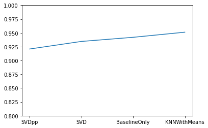
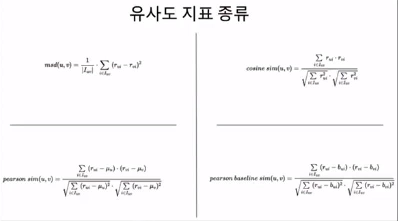

# 👍Section 05_ Surprise 패키지 사용[↩](../../)

## 📑contents<a id='contents'></a>

* 0_ 들어가기 전에[✏️](#0)
* 1_ Surprise 기본 활용 방법[✏️](#1)
* 2_ 알고리즘 비교[✏️](#2)
* 3_ 알고리즘 옵션 지정[✏️](#3)
* 4_ 다양한 조건의 비교[✏️](#4)
* 5_ 외부 데이터 사용[✏️](#5)

## 0_ 들어가기 전에[📑](#contents)<a id='0'></a>

```python
!pip install scikit-surprise 					# 일반적인 경우
!conda install -c cond-forge scikit-surprise	# 아나콘다의 경우
```

## 1_ Surprise 기본 활용 방법[📑](#contents)<a id='1'></a>

* ml-100k : MovieLens 100k 데이터(앞에서 계속 사용해온 데이터)
* ml-1m : MovieLens 1m데이터(100만개)
* jester : 조크사이트 게시물(650 만개)
* `Surprise()`에서 예측 알고리즘 패키지 [🔗](https://surprise.readthedocs.io/en/stable/prediction_algorithms_package.html)

| 알고리즘                                                     | 설명                                                         |
| ------------------------------------------------------------ | ------------------------------------------------------------ |
| [`random_pred.NormalPredictor`](https://surprise.readthedocs.io/en/stable/basic_algorithms.html#surprise.prediction_algorithms.random_pred.NormalPredictor) | Training set의 분포가 정규분포라고 가정한 상태에서 평점을 무작위로 추출하는 알고리즘. 일반적으로 성능이 안좋음. |
| [`baseline_only.BaselineOnly`](https://surprise.readthedocs.io/en/stable/basic_algorithms.html#surprise.prediction_algorithms.baseline_only.BaselineOnly) | 사용자의 평점평균과 아이템의 평점평균을 모델화해서 예측하는 알고리즘 |
| [`knns.KNNBasic`](https://surprise.readthedocs.io/en/stable/knn_inspired.html#surprise.prediction_algorithms.knns.KNNBasic) | 3.4번째 강의에서 소개한 집단을 고려한 기본적인 CF 알고리즘   |
| [`knns.KNNWithMeans`](https://surprise.readthedocs.io/en/stable/knn_inspired.html#surprise.prediction_algorithms.knns.KNNWithMeans) | 3.6번째 강의에서 소개한 사용자의 평가경향을 고려한 CF알고리즘 |
| [`knns.KNNWithZScore`](https://surprise.readthedocs.io/en/stable/knn_inspired.html#surprise.prediction_algorithms.knns.KNNWithZScore) | 사용자의 평가경향을 표준(정규분포)화시킨 CF알고리즘          |
| [`knns.KNNBaseline`](https://surprise.readthedocs.io/en/stable/knn_inspired.html#surprise.prediction_algorithms.knns.KNNBaseline) | 사용자의 평점평균과 아이템의 평점평균을 모델화 시킨 것(Baseline rating)을 고려한 CF 알고리즘 |
| [`matrix_factorization.SVD`](https://surprise.readthedocs.io/en/stable/matrix_factorization.html#surprise.prediction_algorithms.matrix_factorization.SVD) | 4.4번재 강의에서 설명한 MF알고리즘                           |
| [`matrix_factorization.SVDpp`](https://surprise.readthedocs.io/en/stable/matrix_factorization.html#surprise.prediction_algorithms.matrix_factorization.SVDpp) | MF를 기반으로 사용자의 특정 아이템에 대한 평가여부를 이진값으로 일종의 암묵적 평가(Implicit ratings)로 추가한 SVD++알고리즘 |
| [`matrix_factorization.NMF`](https://surprise.readthedocs.io/en/stable/matrix_factorization.html#surprise.prediction_algorithms.matrix_factorization.NMF) | 행렬의 값이 전부 양수일때 사용가능한 MF 알고리즘             |
| [`slope_one.SlopeOne`](https://surprise.readthedocs.io/en/stable/slope_one.html#surprise.prediction_algorithms.slope_one.SlopeOne) | 간단하면서도 정확도가 높은 것이 특징인 SlopeOne알고리즘을 적용한 Item-Based CF 알고리즘 |
| [`co_clustering.CoClustering`](https://surprise.readthedocs.io/en/stable/co_clustering.html#surprise.prediction_algorithms.co_clustering.CoClustering) | 사용자와 아이템을 동시에 클러스터링하는 기법을 적용한 CF알고리즘 |

* 패키지 설치

  ```python
  !pip install scikit-surprise
  ```

* 패키지 사용하여 분석

  ```python
  import numpy as np
  
  from surprise import BaselineOnly, KNNWithMeans, SVD, SVDpp, Dataset, accuracy, Reader
  from surprise.model_selection import cross_validate, train_test_split
  
  data = Dataset.load_builtin(name='ml-100k')
  
  # train test 분리
  trainset, testset = train_test_split(data, test_size=0.25)
  
  algo = KNNWithMeans()
  
  algo.fit(trainset)
  
  prediction = algo.test(testset)
  
  accuracy.rmse(prediction)
  ```


## 2_ 알고리즘 비교[📑](#contents)<a id='2'></a>

| 알고리즘       |                                                              |
| -------------- | ------------------------------------------------------------ |
| `BaselineOnly` | 사용자의 평점 평균과 아이템의 평점평균을 모델화 해서 예측하는 알고리즘 |
| `KNNWithMeans` | 사용자의 평가 경향까지 고려한 CF                             |
| `SVD`          | mf 기반 알고리즘                                             |
| `SVDpp`        | mf  기반 알고리즘을 이진 값으로 일종의 암묵적 평가까지 추가해서 고려한 알고리즘 |

* 비교 구현

  ```python
  #비교에 필요한 Surprise 알고리즘
  from surprise import BaselineOnly
  from surprise import KNNWithMeans
  from surprise import SVD
  from surprise import SVDpp
  
  # 정확도 측정 관련 모듈을 가져온다.
  from surprise import accuracy
  
  # Dataset관련 모듈을 가져온다.
  from surprise import Dataset
  
  # train/test set 분리 관련 모듈을 가져온다.
  from surprise.model_selection import train_test_split
  
  # 결과를 그래프로 표시하기 위한 라이브러리
  import matplotlib.pyplot as plt
  
  # MovieLens 100k 데이터 불러오기
  data = Dataset.load_builtin(name=u'ml-100k')
  
  # train/test 0.75 : 0.25로 분리
  
  trainset, testset = train_test_split(data, test_size=0.25)
  
  algorithms = [BaselineOnly, KNNWithMeans, SVD, SVDpp]
  
  names = []
  results = []
  
  for option in algorithms:
      algo = option()
      names.append(option.__name__)
      algo.fit(trainset)
      predictions = algo.test(testset)
      results.append(accuracy.rmse(predictions))
  names = np.array(names)
  results = np.array(results)
  
  index = np.argsort(results)
  plt.ylim(0.8, 1)
  plt.plot(names[index], results[index])
  results[index]
  
  # 실행 결과
  Estimating biases using als...
  RMSE: 0.9420
  Computing the msd similarity matrix...
  Done computing similarity matrix.
  RMSE: 0.9512
  RMSE: 0.9345
  RMSE: 0.9208
  array([0.92080759, 0.9345095 , 0.941986  , 0.95123484])
  ```

  

## 3_ 알고리즘 옵션 지정[📑](#contents)<a id='3'></a>

```python
# 알고리즘 옵션에 대해 딕셔너리 형태로 저장
sim_options = {'name': 'pearson_baseline', # name에다가 유사도 지표의 종류를 설정
               'user_based': True}          # True는 유저 베이스 CF
algo = KNNWithMeans(k=30, sim_options=sim_options)
algo.fit(trainset)
predictions = algo.test(testset)
accuracy.rmse(predictions)

# 실행 결과
Estimating biases using als...
Computing the pearson_baseline similarity matrix...
Done computing similarity matrix.
RMSE: 0.9399
0.9399320564069582
```




| 유사도 지표            | 설명                                                         |
| ---------------------- | ------------------------------------------------------------ |
| `msd`                  | 두 사용자간 공통으로 평가하는 아이템의 총 갯수와 공통 평가 영화에 대한 아이템의 평점 차이를 계산함. |
| `cosine_sim`           | 사용자와는 아이템을 찾을때, 교집합 안에서만 비교             |
| `pearson_sim`          | 두 벡터의 상관계수<br />상대적인 방식의 유사도               |
| `pearson_baseline_sim` | 베이스라인에서 예측한 베이스 값을 빼줌.                      |

## 4_ 다양한 조건의 비교[📑](#contents)<a id='4'></a>

```python
# 집단과 사용자의 평가경향을 함께 고려한 CF 알고리즘
from surprise import KNNWithMeans

# Dataset관련 모듈을 가져온다.
from surprise import Dataset

# 정확도 측정 관련 모듈을 가져온다.
from surprise import accuracy

# train/test set 분리 관련 모듈을 가져온다.
from surprise.model_selection import train_test_split

data = Dataset.load_builtin(name=u'ml-100k')

# train/test 0.75 : 0.25로 분리
trainset, testset = train_test_split(data, test_size=0.25)

result = []

for neighbor_size in (10, 20, 30, 40, 50, 60):
    algo = KNNWithMeans(k=neighbor_size, 
                        sim_options={'name':'pearson_baseline', 
                        'user_based': True})
    algo.fit(trainset)
    predictions = algo.test(testset)
    result.append([neighbor_size, accuracy.rmse(predictions)])

result

# 실행 결과
Estimating biases using als...
Computing the pearson_baseline similarity matrix...
Done computing similarity matrix.
RMSE: 0.9613
Estimating biases using als...
Computing the pearson_baseline similarity matrix...
Done computing similarity matrix.
RMSE: 0.9481
Estimating biases using als...
Computing the pearson_baseline similarity matrix...
Done computing similarity matrix.
RMSE: 0.9456
Estimating biases using als...
Computing the pearson_baseline similarity matrix...
Done computing similarity matrix.
RMSE: 0.9454
Estimating biases using als...
Computing the pearson_baseline similarity matrix...
Done computing similarity matrix.
RMSE: 0.9455
Estimating biases using als...
Computing the pearson_baseline similarity matrix...
Done computing similarity matrix.
RMSE: 0.9458
[[10, 0.9613315707363571],
 [20, 0.9480987237220185],
 [30, 0.9456218907663596],
 [40, 0.9453857146472053],
 [50, 0.9455253980578735],
 [60, 0.9457836179502214]]
```

* 일일이 하이퍼파라미터를 찾는 것이 찾는 것이 어려움...

* 이 어려움을 해결하기 위한 `GridSearchCV`

* KNN 다양한 파라미터 비교 구현

  ```python
  # Grid Search를 위한 모듈 가져오기
  from surprise.model_selection import GridSearchCV
  param_grid = {
      'k': [5, 10, 15, 25],
      'sim_options': {'name': ['pearson_baseline', 'cosine'],     # 리스트 형태로 만듦.
                      'user_based': [True, False]
      }
  }
  
  gs = GridSearchCV(KNNWithMeans,
                  param_grid, 
                  measures=['rmse'], 
                  cv=4)                   # cv란?데이터를 몇개의 세트로 나누어 크로스 밸류에이션 할것인지? 정확도를 4번 계산하여 평균을 계산함.
  
  gs.fit(data)
  
  # 실행 결과
  Estimating biases using als...
  Computing the pearson_baseline similarity matrix...
  Done computing similarity matrix.
  Estimating biases using als...
  Computing the pearson_baseline similarity matrix...
  Done computing similarity matrix.
  Estimating biases using als...
  Computing the pearson_baseline similarity matrix...
  Done computing similarity matrix.
  Estimating biases using als...
  Computing the pearson_baseline similarity matrix...
  Done computing similarity matrix.
  Estimating biases using als...
  Computing the pearson_baseline similarity matrix...
  Done computing similarity matrix.
  Estimating biases using als...
  Computing the pearson_baseline similarity matrix...
  Done computing similarity matrix.
  Estimating biases using als...
  Computing the pearson_baseline similarity matrix...
  Done computing similarity matrix.
  Estimating biases using als...
  Computing the pearson_baseline similarity matrix...
  Done computing similarity matrix.
  Computing the cosine similarity matrix...
  Done computing similarity matrix.
  Computing the cosine similarity matrix...
  Done computing similarity matrix.
  Computing the cosine similarity matrix...
  Done computing similarity matrix.
  Computing the cosine similarity matrix...
  Done computing similarity matrix.
  Computing the cosine similarity matrix...
  Done computing similarity matrix.
  Computing the cosine similarity matrix...
  Done computing similarity matrix.
  Computing the cosine similarity matrix...
  Done computing similarity matrix.
  Computing the cosine similarity matrix...
  Done computing similarity matrix.
  Estimating biases using als...
  Computing the pearson_baseline similarity matrix...
  Done computing similarity matrix.
  Estimating biases using als...
  Computing the pearson_baseline similarity matrix...
  Done computing similarity matrix.
  Estimating biases using als...
  Computing the pearson_baseline similarity matrix...
  Done computing similarity matrix.
  Estimating biases using als...
  Computing the pearson_baseline similarity matrix...
  Done computing similarity matrix.
  Estimating biases using als...
  Computing the pearson_baseline similarity matrix...
  Done computing similarity matrix.
  Estimating biases using als...
  Computing the pearson_baseline similarity matrix...
  Done computing similarity matrix.
  Estimating biases using als...
  Computing the pearson_baseline similarity matrix...
  Done computing similarity matrix.
  Estimating biases using als...
  Computing the pearson_baseline similarity matrix...
  Done computing similarity matrix.
  Computing the cosine similarity matrix...
  Done computing similarity matrix.
  Computing the cosine similarity matrix...
  Done computing similarity matrix.
  Computing the cosine similarity matrix...
  Done computing similarity matrix.
  Computing the cosine similarity matrix...
  Done computing similarity matrix.
  Computing the cosine similarity matrix...
  Done computing similarity matrix.
  Computing the cosine similarity matrix...
  Done computing similarity matrix.
  Computing the cosine similarity matrix...
  Done computing similarity matrix.
  Computing the cosine similarity matrix...
  Done computing similarity matrix.
  Estimating biases using als...
  Computing the pearson_baseline similarity matrix...
  Done computing similarity matrix.
  Estimating biases using als...
  Computing the pearson_baseline similarity matrix...
  Done computing similarity matrix.
  Estimating biases using als...
  Computing the pearson_baseline similarity matrix...
  Done computing similarity matrix.
  Estimating biases using als...
  Computing the pearson_baseline similarity matrix...
  Done computing similarity matrix.
  Estimating biases using als...
  Computing the pearson_baseline similarity matrix...
  Done computing similarity matrix.
  Estimating biases using als...
  Computing the pearson_baseline similarity matrix...
  Done computing similarity matrix.
  Estimating biases using als...
  Computing the pearson_baseline similarity matrix...
  Done computing similarity matrix.
  Estimating biases using als...
  Computing the pearson_baseline similarity matrix...
  Done computing similarity matrix.
  Computing the cosine similarity matrix...
  Done computing similarity matrix.
  Computing the cosine similarity matrix...
  Done computing similarity matrix.
  Computing the cosine similarity matrix...
  Done computing similarity matrix.
  Computing the cosine similarity matrix...
  Done computing similarity matrix.
  Computing the cosine similarity matrix...
  Done computing similarity matrix.
  Computing the cosine similarity matrix...
  Done computing similarity matrix.
  Computing the cosine similarity matrix...
  Done computing similarity matrix.
  Computing the cosine similarity matrix...
  Done computing similarity matrix.
  Estimating biases using als...
  Computing the pearson_baseline similarity matrix...
  Done computing similarity matrix.
  Estimating biases using als...
  Computing the pearson_baseline similarity matrix...
  Done computing similarity matrix.
  Estimating biases using als...
  Computing the pearson_baseline similarity matrix...
  Done computing similarity matrix.
  Estimating biases using als...
  Computing the pearson_baseline similarity matrix...
  Done computing similarity matrix.
  Estimating biases using als...
  Computing the pearson_baseline similarity matrix...
  Done computing similarity matrix.
  Estimating biases using als...
  Computing the pearson_baseline similarity matrix...
  Done computing similarity matrix.
  Estimating biases using als...
  Computing the pearson_baseline similarity matrix...
  Done computing similarity matrix.
  Estimating biases using als...
  Computing the pearson_baseline similarity matrix...
  Done computing similarity matrix.
  Computing the cosine similarity matrix...
  Done computing similarity matrix.
  Computing the cosine similarity matrix...
  Done computing similarity matrix.
  Computing the cosine similarity matrix...
  Done computing similarity matrix.
  Computing the cosine similarity matrix...
  Done computing similarity matrix.
  Computing the cosine similarity matrix...
  Done computing similarity matrix.
  Computing the cosine similarity matrix...
  Done computing similarity matrix.
  Computing the cosine similarity matrix...
  Done computing similarity matrix.
  Computing the cosine similarity matrix...
  Done computing similarity matrix.
  ```

* SVD 다양한 파라미터 비교

  ```python
  from surprise import SVD
  from surprise.model_selection import GridSearchCV
  
  param_grid = {
      'n_epochs': [70, 80, 90],
      'lr_all': [0.005, 0.006, 0.007],
      'reg_all': [0.05, 0.07, 0.1]
  }
  gs = GridSearchCV(algo_class = SVD,
                  param_grid = param_grid,
                  measures=['rmse'],
                  cv=4)
  gs.fit(data)
  
  print(gs.best_score('rmse'))
  
  print(gs.best_params['rmse'])
  ```

## 5_ 외부 데이터 사용[📑](#contents)<a id='5'></a>

```python
# csv 파일에서 불러오기
import pandas as pd
# 데이터 읽기 관련된 모듈을 가져온다.
from surprise import Reader
# Dataset 관련 모듈을 가져온다.
from surprise import Dataset

# DataFrame 형태로 데이터를 읽어온다.
r_cols = ['user_id', 'movie_id', 'rating','timestamp']
ratings = pd.read_csv('./Data/u.data',
                        names=r_cols,
                        sep='\t',
                        encoding='latin-1')

reader = Reader(rating_scale=(1,5))
data = Dataset.load_from_df(ratings[['user_id', 'movie_id', 'rating']], reader)
```

