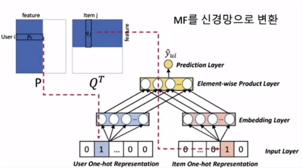
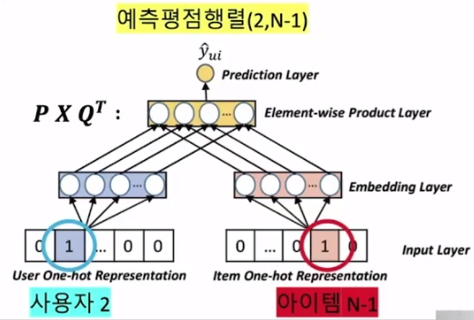
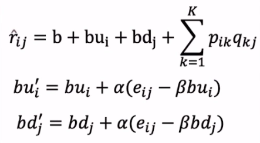
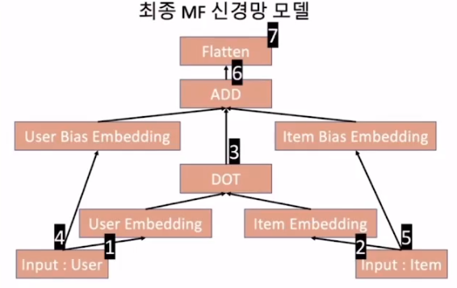
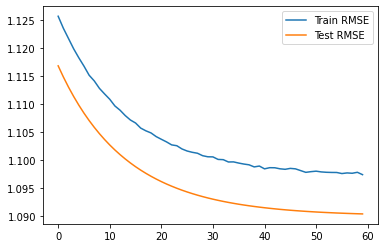
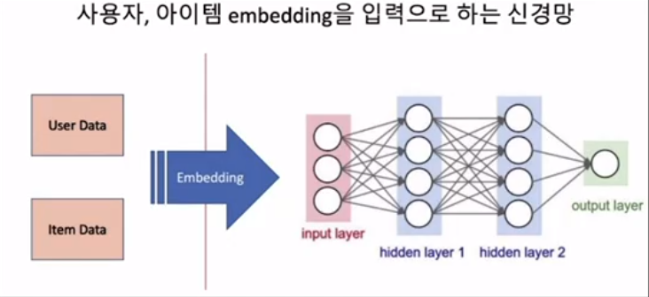
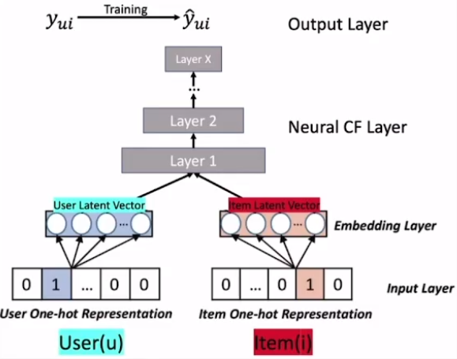
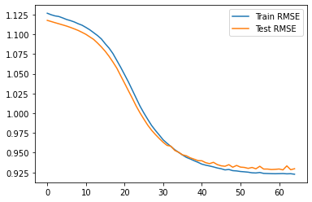

# 👍Section 06_ 딥러닝을 사용한 추천 시스템[↩](../../)

## contents📑<a id='contents'></a>

* 0_ 들어가기 전에[✏️](#0)
* 1_ Maxtrix Factorization(MF)을 신경망으로 변환하기[✏️](#1)
* 2_ Keras로 MF 구현하기[✏️](#2)
* 3_ 딥러닝을 적용한 추천 시스템[✏️](#3)

## 0_ 들어가기 전에[📑](#contents)<a id='0'></a>

* 딥러닝(Deep Learning : DL)은 다수의 은닉층(hidden layer)을 가진 인공신경망을 적용한 기법

## 1_ Maxtrix Factorization(MF)을 신경망으로 변환하기[📑](#contents)<a id='1'></a>



* `MF`를 `Keras`로
* input layer : 각 사용자와 item으로 부터 입력을 받는 부분
  * one-hot representation : 원핫인코딩과 같음. 1인지 0인지를 binary한 형태로 바꿔줌. 
* 사용자의 One-Hot Represention 입력

|        | feature 1 | feature 2 | feature 3 | ...  | feature M |
| ------ | --------- | --------- | --------- | ---- | --------- |
| User 1 | 1         | 0         | 0         | 0    | 0         |
| User 2 | 0         | 1         | 0         | 0    | 0         |
| User 3 | 0         | 0         | 1         | 0    | 0         |
| ...    | 0         | 0         | 0         | 1    | 0         |
| User M | 0         | 0         | 0         | 0    | 1         |

* embedding Layer : 잠재요인 K를 규정

  

  * 사용자 노드에 모두 연결됨. 즉, 화살표가 갯수가 M*K개가 연결되어 있음. 
  * 한 사용자당 K개의 화살표가 있음.
  * 만약 item이면 N* K가 연결되어 있음.

* MP : P(M * K)와 Q(N * K)가 연결됨. 

* Element-wise Product Layer

  

  * 사용자와 아이템의 각 프로덕트 연산을 위한 layer
  * P * Q<sup>T</sup>

* 사용자와 아이템의 평가경향(bias)

  

* 총 정리

  

  1. 사용자 아이템 두가지의 원핫 레프리젠테이션을 진행함.
  2. 사용자 입력은 K개의 노드를 갖는 유저, 아이템 임베딩과 연결
  3. 유저 임베딩과 아이템 임베딩은 DOT프로덕트연산으로 연결
  4. 다시 입력으로 돌아와 1개의 사용자가 각각 아이템 평가 경향, 유저 평가 경향 임베딩과 연결됨.
  5. 마지막으로 유저평가 경향 임베딩, 아이템 평가 경향임베딩, DOT 이 결함됨. 
  6. Flattten은 차원을 줄여주는 역할을 함. 

* 위에서 BU와 BD는 구현을 했는데. B(상수)를 구현하진 못함.

  * 전체 평균을 일률적으로 빼서 편성하게 됨. 

## 2_ Keras로 MF 구현하기[📑](#contents)<a id='2'></a>

* 파일 불러오기

  ```python
  # csv 파일에서 불러오기
  import  pandas as pd
  
  # train set과 test set을 나누기 위한 라이브러리
  from sklearn.model_selection import train_test_split
  
  # 필요한 tensorflow 모듈들을 가져온다.
  import tensorflow as tf
  from tensorflow.keras import layers
  from tensorflow.keras.models import Model
  from tensorflow.keras.layers import Input, Embedding, Dot, Add, Flatten
  from tensorflow.keras.regularizers import l2
  from tensorflow.keras.optimizers import SGD, Adamax
  
  # DataFrame 형태로 데이터를 읽어온다.
  r_cols = ['user_id', 'movie_id', 'rating', 'timestamp']
  ratings = pd.read_csv('./Data/u.data',
                          names=r_cols,
                          sep='\t',
                          encoding='latin-1')
  
  ratings_train, ratings_test = train_test_split(ratings,
                                                  test_size=0.2,
                                                  shuffle=True,
                                                  random_state=2021)
  ```

* 데이터 설정

  ```python
  K = 200
  
  mu = ratings_train.rating.mean()
  
  M = ratings.user_id.max() + 1
  N = ratings.movie_id.max() + 1      # bias_com의 크기 1을 감안하는 것!
  
  def RMSE(y_true, y_pred):
      return tf.sqrt(tf.reduce_mean(tf.square(y_true - y_pred)))
  ```

* P, Q 사용자 평가 경향 임베딩

  ```python
  user = Input(shape=(1,))
  item = Input(shape=(1,))
  
  P_embedding = Embedding(M, K, embeddings_regularizer=l2())(user)
  Q_embedding = Embedding(N, K, embeddings_regularizer=l2())(item)
  
  user_bias = Embedding(M, 1, embeddings_regularizer=l2())(user)
  item_bias = Embedding(N, 1, embeddings_regularizer=l2())(item)
  ```

* 요약 출력

  ```python
  R = layers.dot([P_embedding, Q_embedding], axes=(2,2)) # k와 k끼리 연산을 하겠다.
  
  R = layers.add([R, user_bias, item_bias])
  
  R = Flatten()(R)
  
  model = Model(inputs=[user, item], outputs=R)
  model.compile(
      loss=RMSE,
      optimizer=SGD(),
      metrics=[RMSE]
  )
  
  model.summary()
  
  # 실행 결과
  Model: "model"
  __________________________________________________________________________________________________
  Layer (type)                    Output Shape         Param #     Connected to                     
  ==================================================================================================
  input_3 (InputLayer)            [(None, 1)]          0                                            
  __________________________________________________________________________________________________
  input_4 (InputLayer)            [(None, 1)]          0                                            
  __________________________________________________________________________________________________
  embedding (Embedding)           (None, 1, 200)       188800      input_3[0][0]                    
  __________________________________________________________________________________________________
  embedding_1 (Embedding)         (None, 1, 200)       336600      input_4[0][0]                    
  __________________________________________________________________________________________________
  dot (Dot)                       (None, 1, 1)         0           embedding[0][0]                  
                                                                   embedding_1[0][0]                
  __________________________________________________________________________________________________
  embedding_2 (Embedding)         (None, 1, 1)         944         input_3[0][0]                    
  __________________________________________________________________________________________________
  embedding_3 (Embedding)         (None, 1, 1)         1683        input_4[0][0]                    
  __________________________________________________________________________________________________
  add (Add)                       (None, 1, 1)         0           dot[0][0]                        
                                                                   embedding_2[0][0]                
                                                                   embedding_3[0][0]                
  __________________________________________________________________________________________________
  flatten (Flatten)               (None, 1)            0           add[0][0]                        
  ==================================================================================================
  Total params: 528,027
  Trainable params: 528,027
  Non-trainable params: 0
  __________________________________________________________________________________________________
  
  ```

* 모델 생성

  ```python
  result = model.fit(
      x = [ratings_train.user_id.values,
      ratings_train.movie_id.values],
      y = ratings_train.values - mu,
  
      epochs=60,
      batch_size=256,
      validation_data=(
          [ratings_test.user_id.values,
          ratings_test.movie_id.values],
          ratings_test.rating.values - mu
      )
  
  )
  
  # 실행 결과
  Epoch 1/60
  313/313 [==============================] - 1s 3ms/step - loss: 441776288.0000 - RMSE: 441776128.0000 - val_loss: 5.0007 - val_RMSE: 1.1188
  Epoch 2/60
  313/313 [==============================] - 1s 3ms/step - loss: 441776288.0000 - RMSE: 441776928.0000 - val_loss: 4.5440 - val_RMSE: 1.1186
  Epoch 3/60
  313/313 [==============================] - 1s 3ms/step - loss: 441776448.0000 - RMSE: 441776960.0000 - val_loss: 4.1412 - val_RMSE: 1.1185
  Epoch 4/60
  313/313 [==============================] - 1s 3ms/step - loss: 441776192.0000 - RMSE: 441776384.0000 - val_loss: 3.7860 - val_RMSE: 1.1184
  Epoch 5/60
  313/313 [==============================] - 1s 3ms/step - loss: 441776224.0000 - RMSE: 441775712.0000 - val_loss: 3.4727 - val_RMSE: 1.1184
  Epoch 6/60
  313/313 [==============================] - 1s 3ms/step - loss: 441776352.0000 - RMSE: 441776704.0000 - val_loss: 3.1965 - val_RMSE: 1.1183
  Epoch 7/60
  313/313 [==============================] - 1s 3ms/step - loss: 441776288.0000 - RMSE: 441776544.0000 - val_loss: 2.9528 - val_RMSE: 1.1183
  Epoch 8/60
  313/313 [==============================] - 1s 3ms/step - loss: 441776352.0000 - RMSE: 441776704.0000 - val_loss: 2.7380 - val_RMSE: 1.1183
  Epoch 9/60
  313/313 [==============================] - 1s 3ms/step - loss: 441776448.0000 - RMSE: 441776544.0000 - val_loss: 2.5486 - val_RMSE: 1.1184
  Epoch 10/60
  313/313 [==============================] - 1s 3ms/step - loss: 441776224.0000 - RMSE: 441776512.0000 - val_loss: 2.3816 - val_RMSE: 1.1184
  Epoch 11/60
  313/313 [==============================] - 1s 3ms/step - loss: 441776384.0000 - RMSE: 441777280.0000 - val_loss: 2.2343 - val_RMSE: 1.1184
  Epoch 12/60
  313/313 [==============================] - 1s 3ms/step - loss: 441776192.0000 - RMSE: 441775808.0000 - val_loss: 2.1044 - val_RMSE: 1.1185
  Epoch 13/60
  313/313 [==============================] - 1s 3ms/step - loss: 441776448.0000 - RMSE: 441776128.0000 - val_loss: 1.9900 - val_RMSE: 1.1185
  Epoch 14/60
  313/313 [==============================] - 1s 3ms/step - loss: 441776128.0000 - RMSE: 441776928.0000 - val_loss: 1.8890 - val_RMSE: 1.1186
  Epoch 15/60
  313/313 [==============================] - 1s 3ms/step - loss: 441776448.0000 - RMSE: 441776192.0000 - val_loss: 1.8001 - val_RMSE: 1.1186
  Epoch 16/60
  313/313 [==============================] - 1s 3ms/step - loss: 441776192.0000 - RMSE: 441776512.0000 - val_loss: 1.7217 - val_RMSE: 1.1187
  Epoch 17/60
  313/313 [==============================] - 1s 3ms/step - loss: 441776384.0000 - RMSE: 441776384.0000 - val_loss: 1.6525 - val_RMSE: 1.1188
  Epoch 18/60
  313/313 [==============================] - 1s 3ms/step - loss: 441776288.0000 - RMSE: 441775360.0000 - val_loss: 1.5916 - val_RMSE: 1.1188
  Epoch 19/60
  313/313 [==============================] - 1s 3ms/step - loss: 441776224.0000 - RMSE: 441775392.0000 - val_loss: 1.5379 - val_RMSE: 1.1189
  Epoch 20/60
  313/313 [==============================] - 1s 3ms/step - loss: 441776224.0000 - RMSE: 441776192.0000 - val_loss: 1.4906 - val_RMSE: 1.1190
  Epoch 21/60
  313/313 [==============================] - 1s 3ms/step - loss: 441776384.0000 - RMSE: 441776288.0000 - val_loss: 1.4489 - val_RMSE: 1.1190
  Epoch 22/60
  313/313 [==============================] - 1s 3ms/step - loss: 441776288.0000 - RMSE: 441776608.0000 - val_loss: 1.4122 - val_RMSE: 1.1191
  Epoch 23/60
  313/313 [==============================] - 1s 3ms/step - loss: 441776512.0000 - RMSE: 441775968.0000 - val_loss: 1.3798 - val_RMSE: 1.1191
  Epoch 24/60
  313/313 [==============================] - 1s 3ms/step - loss: 441776544.0000 - RMSE: 441775936.0000 - val_loss: 1.3513 - val_RMSE: 1.1192
  Epoch 25/60
  313/313 [==============================] - 1s 3ms/step - loss: 441776192.0000 - RMSE: 441775936.0000 - val_loss: 1.3262 - val_RMSE: 1.1193
  Epoch 26/60
  313/313 [==============================] - 1s 3ms/step - loss: 441776224.0000 - RMSE: 441776704.0000 - val_loss: 1.3041 - val_RMSE: 1.1193
  Epoch 27/60
  313/313 [==============================] - 1s 3ms/step - loss: 441776448.0000 - RMSE: 441777280.0000 - val_loss: 1.2846 - val_RMSE: 1.1194
  Epoch 28/60
  313/313 [==============================] - 1s 3ms/step - loss: 441776608.0000 - RMSE: 441777248.0000 - val_loss: 1.2674 - val_RMSE: 1.1194
  Epoch 29/60
  313/313 [==============================] - 1s 3ms/step - loss: 441776224.0000 - RMSE: 441776224.0000 - val_loss: 1.2523 - val_RMSE: 1.1195
  Epoch 30/60
  313/313 [==============================] - 1s 3ms/step - loss: 441776288.0000 - RMSE: 441776224.0000 - val_loss: 1.2391 - val_RMSE: 1.1195
  Epoch 31/60
  313/313 [==============================] - 1s 3ms/step - loss: 441776352.0000 - RMSE: 441777376.0000 - val_loss: 1.2274 - val_RMSE: 1.1196
  Epoch 32/60
  313/313 [==============================] - 1s 3ms/step - loss: 441776512.0000 - RMSE: 441776448.0000 - val_loss: 1.2171 - val_RMSE: 1.1196
  Epoch 33/60
  313/313 [==============================] - 1s 3ms/step - loss: 441776288.0000 - RMSE: 441775712.0000 - val_loss: 1.2080 - val_RMSE: 1.1196
  Epoch 34/60
  313/313 [==============================] - 1s 3ms/step - loss: 441776352.0000 - RMSE: 441775968.0000 - val_loss: 1.2000 - val_RMSE: 1.1197
  Epoch 35/60
  313/313 [==============================] - 1s 3ms/step - loss: 441776128.0000 - RMSE: 441776384.0000 - val_loss: 1.1930 - val_RMSE: 1.1197
  Epoch 36/60
  313/313 [==============================] - 1s 3ms/step - loss: 441776224.0000 - RMSE: 441776448.0000 - val_loss: 1.1869 - val_RMSE: 1.1197
  Epoch 37/60
  313/313 [==============================] - 1s 3ms/step - loss: 441776352.0000 - RMSE: 441776192.0000 - val_loss: 1.1814 - val_RMSE: 1.1198
  Epoch 38/60
  313/313 [==============================] - 1s 3ms/step - loss: 441776288.0000 - RMSE: 441777248.0000 - val_loss: 1.1767 - val_RMSE: 1.1198
  Epoch 39/60
  313/313 [==============================] - 1s 3ms/step - loss: 441776128.0000 - RMSE: 441775648.0000 - val_loss: 1.1725 - val_RMSE: 1.1198
  Epoch 40/60
  313/313 [==============================] - 1s 3ms/step - loss: 441776512.0000 - RMSE: 441776768.0000 - val_loss: 1.1688 - val_RMSE: 1.1199
  Epoch 41/60
  313/313 [==============================] - 1s 3ms/step - loss: 441776128.0000 - RMSE: 441775360.0000 - val_loss: 1.1656 - val_RMSE: 1.1199
  Epoch 42/60
  313/313 [==============================] - 1s 3ms/step - loss: 441776384.0000 - RMSE: 441776512.0000 - val_loss: 1.1628 - val_RMSE: 1.1199
  Epoch 43/60
  313/313 [==============================] - 1s 3ms/step - loss: 441776224.0000 - RMSE: 441776128.0000 - val_loss: 1.1603 - val_RMSE: 1.1200
  Epoch 44/60
  313/313 [==============================] - 1s 3ms/step - loss: 441776288.0000 - RMSE: 441776128.0000 - val_loss: 1.1581 - val_RMSE: 1.1200
  Epoch 45/60
  313/313 [==============================] - 1s 3ms/step - loss: 441776544.0000 - RMSE: 441776512.0000 - val_loss: 1.1562 - val_RMSE: 1.1200
  Epoch 46/60
  313/313 [==============================] - 1s 3ms/step - loss: 441776352.0000 - RMSE: 441775808.0000 - val_loss: 1.1545 - val_RMSE: 1.1200
  Epoch 47/60
  313/313 [==============================] - 1s 3ms/step - loss: 441776224.0000 - RMSE: 441775968.0000 - val_loss: 1.1530 - val_RMSE: 1.1200
  Epoch 48/60
  313/313 [==============================] - 1s 3ms/step - loss: 441776448.0000 - RMSE: 441776544.0000 - val_loss: 1.1517 - val_RMSE: 1.1201
  Epoch 49/60
  313/313 [==============================] - 1s 3ms/step - loss: 441776512.0000 - RMSE: 441776384.0000 - val_loss: 1.1506 - val_RMSE: 1.1201
  Epoch 50/60
  313/313 [==============================] - 1s 3ms/step - loss: 441776352.0000 - RMSE: 441776512.0000 - val_loss: 1.1496 - val_RMSE: 1.1201
  Epoch 51/60
  313/313 [==============================] - 1s 3ms/step - loss: 441776352.0000 - RMSE: 441776224.0000 - val_loss: 1.1488 - val_RMSE: 1.1201
  Epoch 52/60
  313/313 [==============================] - 1s 3ms/step - loss: 441776192.0000 - RMSE: 441776032.0000 - val_loss: 1.1480 - val_RMSE: 1.1201
  Epoch 53/60
  313/313 [==============================] - 1s 3ms/step - loss: 441776288.0000 - RMSE: 441776512.0000 - val_loss: 1.1474 - val_RMSE: 1.1201
  Epoch 54/60
  313/313 [==============================] - 1s 3ms/step - loss: 441776448.0000 - RMSE: 441775936.0000 - val_loss: 1.1468 - val_RMSE: 1.1201
  Epoch 55/60
  313/313 [==============================] - 1s 3ms/step - loss: 441776512.0000 - RMSE: 441776768.0000 - val_loss: 1.1463 - val_RMSE: 1.1202
  Epoch 56/60
  313/313 [==============================] - 1s 3ms/step - loss: 441776288.0000 - RMSE: 441775936.0000 - val_loss: 1.1459 - val_RMSE: 1.1202
  Epoch 57/60
  313/313 [==============================] - 1s 3ms/step - loss: 441776384.0000 - RMSE: 441776512.0000 - val_loss: 1.1455 - val_RMSE: 1.1202
  Epoch 58/60
  313/313 [==============================] - 1s 3ms/step - loss: 441776288.0000 - RMSE: 441776768.0000 - val_loss: 1.1452 - val_RMSE: 1.1202
  Epoch 59/60
  313/313 [==============================] - 1s 3ms/step - loss: 441776192.0000 - RMSE: 441776352.0000 - val_loss: 1.1449 - val_RMSE: 1.1202
  Epoch 60/60
  313/313 [==============================] - 1s 3ms/step - loss: 441776192.0000 - RMSE: 441776224.0000 - val_loss: 1.1446 - val_RMSE: 1.1202
  ```

* RMSE 시각화

  ```python
  # plot RMSE
  import matplotlib.pyplot as plt
  
  plt.plot(result.history['RMSE'], label="Train RMSE")
  plt.plot(result.history['val_RMSE'], label = 'Test RMSE')
  plt.legend()
  plt.show()
  ```

  

* 적용해보기

  ```python
  user_ids = ratings_test.user_id.values[0:6] # 적용해보기
  movie_ids = ratings_test.movie_id.values[0:6]
  
  predictions = model.predict([user_ids, movie_ids]) + mu #전체 평균 다시 더하기
  # 실제 값
  print(ratings_test[0:6])
         user_id  movie_id  rating  timestamp
  23307      468        51       3  875293386
  36679       92       780       3  875660494
  36626      555       489       5  879975455
  83753      940        69       2  885921265
  52604      181      1350       1  878962120
  49877      320       195       5  884749255
  # 예측 값
  print(predictions)
  [[3.5550046]
   [3.4723089]
   [3.5492196]
   [3.5690255]
   [3.1871848]
   [3.5966241]]
  ```

* RMSE 설정

  ```python
  import numpy as np
  
  def RMSE2(y_true, y_pred):
    return np.sqrt(np.mean((np.array(y_true)-np.array(y_pred))**2))
  ```

* RMSE 계산

  ```python
  user_ids = ratings_test.user_id.values
  movie_ids = ratings_test.movie_id.values
  
  y_pred = model.predict([user_ids, movie_ids]) + mu
  y_pred = np.ravel(y_pred,order="C") #1차원 형태로 바꿔줌.
  
  y_true = np.array(ratings_test.rating)
  
  RMSE2(y_true, y_pred)
  
  # 실행 결과
  1.0913778530076552
  ```

  * 최적화나 튜닝이 안되어 있기때문에 성능이 좋지 않음.

## 3_ 딥러닝을 적용한 추천 시스템[📑](#contents)<a id='3'></a>



* RAW data 를 embedding
* 이전과 다른 점은 `은닉층`(hidden layer)를 추가함.



* layer1 : user latent vector + item latent vector = `concanating`(결합)을 이용

* 구현

  ```python
  import pandas as pd
  import numpy as np
  
  #train set과 test set을 나누기 위한 라이브러리
  from sklearn.model_selection import train_test_split
  
  #필요한 tensorflow 모듈들을 가져온다.
  import tensorflow as tf
  from tensorflow.keras import layers
  from tensorflow.keras.models import Model
  from tensorflow.keras.layers import Input, Embedding, Dot, Add, Flatten
  from tensorflow.keras.regularizers import l2
  from tensorflow.keras.optimizers import SGD, Adamax
  
  #layer 구성에 필요한 라이브러리 불러오기 
  from tensorflow.keras.layers import Dense, Concatenate, Activation # 이 부분은 레이어 구성을 위해 필요한 리아브러리
  from tensorflow.keras.regularizers import l2 
  from tensorflow.keras.optimizers import SGD, Adamax
  
  #DataFrame 형태로 데이터를 읽어온다.
  r_cols = ['user_id', 'movie_id', 'rating', 'timestamp']
  ratings = pd.read_csv('./Data/u.data', names=r_cols,  sep='\t',encoding='latin-1')
  
  ratings_train, ratings_test = train_test_split(ratings,
                                                 test_size = 0.2,
                                                 shuffle = True,
                                                 random_state = 2021)
  ### Defining RMSE measure ###
  # y_true, y_pred은 신경망에서 실제값, 예측값을 나타내는 Tensorflow/Keras 표준 변수
  def RMSE(y_true, y_pred):
    # Tensorflow의 math클래스에 미리 정의된
    # 제곱근(sqrt), 평균(reduce_mean), 제곱(square) 함수를 통해 RMSE 계산
    return tf.sqrt(tf.reduce_mean(tf.square(y_true-y_pred)))
  
  ### Variable 초기화 ###
  #잠재요인 수 200으로 지정한다.
  K = 200
  
  #전체 평균 계산한다.
  mu = ratings_train.rating.mean()
  
  #사용자 아이디와 영화 아이디의 최댓값 -> 보통은 unique한 값의 개수 + 1로 해야함 
  #1을 더하는 이유 : bias term 추가 고려
  M = ratings.user_id.max() + 1
  N = ratings.movie_id.max() + 1
  
  #################################################################################
  #kreas 모델 
  # 아래부분은 앞에서와 동일하게 사용자와 아이템 데이터를 embedding을 통해
  # 각각 K개의 노드를 갖는 layer로 변환하고
  # 사용자 bias와 아이템 bias를 1개의 노드를 갖는 layer로 변환한다.
  user = Input(shape=(1,))
  item = Input(shape=(1,))
  
  #Embedding
  P_embedding = Embedding(M,K,embeddings_regularizer=l2())(user) #regularizer : 규제 -> 과적합 방지
  Q_embedding = Embedding(N,K,embeddings_regularizer=l2())(item)
  
  #bias
  user_bias = Embedding(M,1,embeddings_regularizer=l2())(user)
  item_bias = Embedding(N,1,embeddings_regularizer=l2())(item)
  
  #앞과 뒤를 한줄로 붙이기
  # 이를 위해서 1자형으로 데이터를 만듦.
  P_embedding = Flatten()(P_embedding)
  Q_embedding = Flatten()(Q_embedding)
  user_bias = Flatten()(user_bias)
  item_bias = Flatten()(item_bias)
  
  R = Concatenate()([P_embedding, Q_embedding, user_bias, item_bias])
  
  R = Dense(2048)(R) #노드가 2048개인 하나의 layer를 만든 후 R과 연결 
  R = Activation('linear')(R) # 위에 있는 Dense레이어를 activation function을 지정함.
  
  R = Dense(256)(R)
  R = Activation('linear')(R)
  
  R = Dense(1)(R) #출력 layer
  
  model = Model(inputs = [user,item],outputs=R)
  
  model.compile(loss=RMSE,
      optimizer=SGD(), #Adamax도 가능
      metrics = [RMSE]
  )
  
  model.summary()
  
  # 실행 결과
  Model: "model_1"
  __________________________________________________________________________________________________
  Layer (type)                    Output Shape         Param #     Connected to                     
  ==================================================================================================
  input_3 (InputLayer)            [(None, 1)]          0                                            
  __________________________________________________________________________________________________
  input_4 (InputLayer)            [(None, 1)]          0                                            
  __________________________________________________________________________________________________
  embedding_4 (Embedding)         (None, 1, 200)       188800      input_3[0][0]                    
  __________________________________________________________________________________________________
  embedding_5 (Embedding)         (None, 1, 200)       336600      input_4[0][0]                    
  __________________________________________________________________________________________________
  embedding_6 (Embedding)         (None, 1, 1)         944         input_3[0][0]                    
  __________________________________________________________________________________________________
  embedding_7 (Embedding)         (None, 1, 1)         1683        input_4[0][0]                    
  __________________________________________________________________________________________________
  flatten_1 (Flatten)             (None, 200)          0           embedding_4[0][0]                
  __________________________________________________________________________________________________
  flatten_2 (Flatten)             (None, 200)          0           embedding_5[0][0]                
  __________________________________________________________________________________________________
  flatten_3 (Flatten)             (None, 1)            0           embedding_6[0][0]                
  __________________________________________________________________________________________________
  flatten_4 (Flatten)             (None, 1)            0           embedding_7[0][0]                
  __________________________________________________________________________________________________
  concatenate (Concatenate)       (None, 402)          0           flatten_1[0][0]                  
                                                                   flatten_2[0][0]                  
                                                                   flatten_3[0][0]                  
                                                                   flatten_4[0][0]                  
  __________________________________________________________________________________________________
  dense (Dense)                   (None, 2048)         825344      concatenate[0][0]                
  __________________________________________________________________________________________________
  activation (Activation)         (None, 2048)         0           dense[0][0]                      
  __________________________________________________________________________________________________
  dense_1 (Dense)                 (None, 256)          524544      activation[0][0]                 
  __________________________________________________________________________________________________
  activation_1 (Activation)       (None, 256)          0           dense_1[0][0]                    
  __________________________________________________________________________________________________
  dense_2 (Dense)                 (None, 1)            257         activation_1[0][0]               
  ==================================================================================================
  Total params: 1,878,172
  Trainable params: 1,878,172
  Non-trainable params: 0
  __________________________________________________________________________________________________
  ```

* 모델 구성

  ```python
  # Model fitting
  # 모델 입력에 필요한 데이터 정리
  train_user_ids = ratings_train.user_id.values
  train_movie_ids = ratings_train.movie_id.values
  train_ratings = ratings_train.rating.values
  
  test_user_ids = ratings_test.user_id.values
  test_movie_ids = ratings_test.movie_id.values
  test_ratings = ratings_test.rating.values
  
  #신경망 학습
  result = model.fit(
      x = [train_user_ids, train_movie_ids],
      y = train_ratings - mu, #전체 평균 빼기 
      epochs = 65,
      batch_size = 512, #batch_size : 전체 train_set에서 512개씩 학습시키겠다.
      validation_data = (
          [test_user_ids, test_movie_ids],
           test_ratings - mu
      )
  )
  
  # 실행 결과
  Epoch 1/65
  157/157 [==============================] - 4s 20ms/step - loss: 5.3929 - RMSE: 1.1267 - val_loss: 5.2497 - val_RMSE: 1.1177
  Epoch 2/65
  157/157 [==============================] - 3s 20ms/step - loss: 5.1316 - RMSE: 1.1248 - val_loss: 4.9967 - val_RMSE: 1.1162
  Epoch 3/65
  157/157 [==============================] - 3s 21ms/step - loss: 4.8863 - RMSE: 1.1233 - val_loss: 4.7592 - val_RMSE: 1.1147
  Epoch 4/65
  157/157 [==============================] - 3s 20ms/step - loss: 4.6559 - RMSE: 1.1225 - val_loss: 4.5361 - val_RMSE: 1.1133
  Epoch 5/65
  157/157 [==============================] - 3s 20ms/step - loss: 4.4394 - RMSE: 1.1207 - val_loss: 4.3265 - val_RMSE: 1.1119
  Epoch 6/65
  157/157 [==============================] - 3s 20ms/step - loss: 4.2360 - RMSE: 1.1188 - val_loss: 4.1296 - val_RMSE: 1.1104
  Epoch 7/65
  157/157 [==============================] - 3s 21ms/step - loss: 4.0449 - RMSE: 1.1173 - val_loss: 3.9444 - val_RMSE: 1.1087
  Epoch 8/65
  157/157 [==============================] - 3s 20ms/step - loss: 3.8653 - RMSE: 1.1156 - val_loss: 3.7702 - val_RMSE: 1.1069
  Epoch 9/65
  157/157 [==============================] - 3s 20ms/step - loss: 3.6962 - RMSE: 1.1134 - val_loss: 3.6065 - val_RMSE: 1.1049
  Epoch 10/65
  157/157 [==============================] - 3s 21ms/step - loss: 3.5371 - RMSE: 1.1115 - val_loss: 3.4523 - val_RMSE: 1.1025
  Epoch 11/65
  157/157 [==============================] - 3s 21ms/step - loss: 3.3874 - RMSE: 1.1087 - val_loss: 3.3073 - val_RMSE: 1.1000
  Epoch 12/65
  157/157 [==============================] - 3s 21ms/step - loss: 3.2463 - RMSE: 1.1057 - val_loss: 3.1704 - val_RMSE: 1.0967
  Epoch 13/65
  157/157 [==============================] - 3s 20ms/step - loss: 3.1132 - RMSE: 1.1021 - val_loss: 3.0417 - val_RMSE: 1.0935
  Epoch 14/65
  157/157 [==============================] - 3s 20ms/step - loss: 2.9875 - RMSE: 1.0984 - val_loss: 2.9194 - val_RMSE: 1.0890
  Epoch 15/65
  157/157 [==============================] - 3s 20ms/step - loss: 2.8687 - RMSE: 1.0941 - val_loss: 2.8041 - val_RMSE: 1.0840
  Epoch 16/65
  157/157 [==============================] - 3s 20ms/step - loss: 2.7562 - RMSE: 1.0881 - val_loss: 2.6950 - val_RMSE: 1.0785
  Epoch 17/65
  157/157 [==============================] - 3s 20ms/step - loss: 2.6496 - RMSE: 1.0825 - val_loss: 2.5915 - val_RMSE: 1.0721
  Epoch 18/65
  157/157 [==============================] - 3s 20ms/step - loss: 2.5483 - RMSE: 1.0756 - val_loss: 2.4933 - val_RMSE: 1.0648
  Epoch 19/65
  157/157 [==============================] - 3s 20ms/step - loss: 2.4521 - RMSE: 1.0669 - val_loss: 2.4002 - val_RMSE: 1.0571
  Epoch 20/65
  157/157 [==============================] - 3s 20ms/step - loss: 2.3606 - RMSE: 1.0582 - val_loss: 2.3107 - val_RMSE: 1.0476
  Epoch 21/65
  157/157 [==============================] - 3s 20ms/step - loss: 2.2735 - RMSE: 1.0490 - val_loss: 2.2264 - val_RMSE: 1.0381
  Epoch 22/65
  157/157 [==============================] - 3s 20ms/step - loss: 2.1910 - RMSE: 1.0396 - val_loss: 2.1465 - val_RMSE: 1.0285
  Epoch 23/65
  157/157 [==============================] - 3s 20ms/step - loss: 2.1125 - RMSE: 1.0295 - val_loss: 2.0711 - val_RMSE: 1.0191
  Epoch 24/65
  157/157 [==============================] - 3s 21ms/step - loss: 2.0385 - RMSE: 1.0192 - val_loss: 1.9992 - val_RMSE: 1.0092
  Epoch 25/65
  157/157 [==============================] - 3s 21ms/step - loss: 1.9688 - RMSE: 1.0090 - val_loss: 1.9322 - val_RMSE: 1.0005
  Epoch 26/65
  157/157 [==============================] - 3s 21ms/step - loss: 1.9033 - RMSE: 1.0003 - val_loss: 1.8695 - val_RMSE: 0.9925
  Epoch 27/65
  157/157 [==============================] - 3s 20ms/step - loss: 1.8419 - RMSE: 0.9922 - val_loss: 1.8103 - val_RMSE: 0.9849
  Epoch 28/65
  157/157 [==============================] - 3s 20ms/step - loss: 1.7844 - RMSE: 0.9845 - val_loss: 1.7553 - val_RMSE: 0.9784
  Epoch 29/65
  157/157 [==============================] - 3s 20ms/step - loss: 1.7305 - RMSE: 0.9781 - val_loss: 1.7042 - val_RMSE: 0.9729
  Epoch 30/65
  157/157 [==============================] - 3s 20ms/step - loss: 1.6803 - RMSE: 0.9723 - val_loss: 1.6562 - val_RMSE: 0.9679
  Epoch 31/65
  157/157 [==============================] - 3s 20ms/step - loss: 1.6334 - RMSE: 0.9662 - val_loss: 1.6110 - val_RMSE: 0.9632
  Epoch 32/65
  157/157 [==============================] - 3s 20ms/step - loss: 1.5894 - RMSE: 0.9619 - val_loss: 1.5692 - val_RMSE: 0.9592
  Epoch 33/65
  157/157 [==============================] - 3s 20ms/step - loss: 1.5483 - RMSE: 0.9578 - val_loss: 1.5323 - val_RMSE: 0.9582
  Epoch 34/65
  157/157 [==============================] - 3s 20ms/step - loss: 1.5099 - RMSE: 0.9537 - val_loss: 1.4935 - val_RMSE: 0.9528
  Epoch 35/65
  157/157 [==============================] - 3s 20ms/step - loss: 1.4740 - RMSE: 0.9503 - val_loss: 1.4595 - val_RMSE: 0.9505
  Epoch 36/65
  157/157 [==============================] - 3s 20ms/step - loss: 1.4402 - RMSE: 0.9471 - val_loss: 1.4266 - val_RMSE: 0.9473
  Epoch 37/65
  157/157 [==============================] - 3s 20ms/step - loss: 1.4087 - RMSE: 0.9441 - val_loss: 1.3974 - val_RMSE: 0.9460
  Epoch 38/65
  157/157 [==============================] - 3s 20ms/step - loss: 1.3793 - RMSE: 0.9421 - val_loss: 1.3688 - val_RMSE: 0.9435
  Epoch 39/65
  157/157 [==============================] - 3s 20ms/step - loss: 1.3515 - RMSE: 0.9398 - val_loss: 1.3424 - val_RMSE: 0.9418
  Epoch 40/65
  157/157 [==============================] - 3s 20ms/step - loss: 1.3257 - RMSE: 0.9378 - val_loss: 1.3174 - val_RMSE: 0.9399
  Epoch 41/65
  157/157 [==============================] - 3s 20ms/step - loss: 1.3014 - RMSE: 0.9355 - val_loss: 1.2954 - val_RMSE: 0.9397
  Epoch 42/65
  157/157 [==============================] - 3s 20ms/step - loss: 1.2786 - RMSE: 0.9342 - val_loss: 1.2726 - val_RMSE: 0.9373
  Epoch 43/65
  157/157 [==============================] - 3s 20ms/step - loss: 1.2575 - RMSE: 0.9331 - val_loss: 1.2521 - val_RMSE: 0.9361
  Epoch 44/65
  157/157 [==============================] - 3s 20ms/step - loss: 1.2375 - RMSE: 0.9320 - val_loss: 1.2359 - val_RMSE: 0.9378
  Epoch 45/65
  157/157 [==============================] - 3s 20ms/step - loss: 1.2187 - RMSE: 0.9306 - val_loss: 1.2158 - val_RMSE: 0.9349
  Epoch 46/65
  157/157 [==============================] - 3s 20ms/step - loss: 1.2011 - RMSE: 0.9296 - val_loss: 1.1984 - val_RMSE: 0.9334
  Epoch 47/65
  157/157 [==============================] - 3s 20ms/step - loss: 1.1849 - RMSE: 0.9282 - val_loss: 1.1827 - val_RMSE: 0.9328
  Epoch 48/65
  157/157 [==============================] - 3s 20ms/step - loss: 1.1696 - RMSE: 0.9287 - val_loss: 1.1705 - val_RMSE: 0.9348
  Epoch 49/65
  157/157 [==============================] - 3s 20ms/step - loss: 1.1549 - RMSE: 0.9272 - val_loss: 1.1541 - val_RMSE: 0.9316
  Epoch 50/65
  157/157 [==============================] - 3s 20ms/step - loss: 1.1416 - RMSE: 0.9269 - val_loss: 1.1438 - val_RMSE: 0.9338
  Epoch 51/65
  157/157 [==============================] - 3s 20ms/step - loss: 1.1289 - RMSE: 0.9261 - val_loss: 1.1300 - val_RMSE: 0.9317
  Epoch 52/65
  157/157 [==============================] - 3s 20ms/step - loss: 1.1171 - RMSE: 0.9258 - val_loss: 1.1184 - val_RMSE: 0.9313
  Epoch 53/65
  157/157 [==============================] - 3s 20ms/step - loss: 1.1059 - RMSE: 0.9253 - val_loss: 1.1068 - val_RMSE: 0.9301
  Epoch 54/65
  157/157 [==============================] - 3s 20ms/step - loss: 1.0952 - RMSE: 0.9245 - val_loss: 1.0984 - val_RMSE: 0.9313
  Epoch 55/65
  157/157 [==============================] - 3s 20ms/step - loss: 1.0856 - RMSE: 0.9243 - val_loss: 1.0873 - val_RMSE: 0.9296
  Epoch 56/65
  157/157 [==============================] - 3s 20ms/step - loss: 1.0763 - RMSE: 0.9249 - val_loss: 1.0819 - val_RMSE: 0.9328
  Epoch 57/65
  157/157 [==============================] - 3s 20ms/step - loss: 1.0676 - RMSE: 0.9237 - val_loss: 1.0702 - val_RMSE: 0.9292
  Epoch 58/65
  157/157 [==============================] - 3s 20ms/step - loss: 1.0595 - RMSE: 0.9235 - val_loss: 1.0627 - val_RMSE: 0.9292
  Epoch 59/65
  157/157 [==============================] - 3s 20ms/step - loss: 1.0521 - RMSE: 0.9234 - val_loss: 1.0547 - val_RMSE: 0.9286
  Epoch 60/65
  157/157 [==============================] - 3s 20ms/step - loss: 1.0446 - RMSE: 0.9233 - val_loss: 1.0482 - val_RMSE: 0.9289
  Epoch 61/65
  157/157 [==============================] - 3s 21ms/step - loss: 1.0379 - RMSE: 0.9234 - val_loss: 1.0424 - val_RMSE: 0.9293
  Epoch 62/65
  157/157 [==============================] - 3s 21ms/step - loss: 1.0319 - RMSE: 0.9235 - val_loss: 1.0352 - val_RMSE: 0.9282
  Epoch 63/65
  157/157 [==============================] - 3s 20ms/step - loss: 1.0259 - RMSE: 0.9232 - val_loss: 1.0344 - val_RMSE: 0.9333
  Epoch 64/65
  157/157 [==============================] - 3s 20ms/step - loss: 1.0203 - RMSE: 0.9233 - val_loss: 1.0244 - val_RMSE: 0.9284
  Epoch 65/65
  157/157 [==============================] - 3s 20ms/step - loss: 1.0147 - RMSE: 0.9227 - val_loss: 1.0206 - val_RMSE: 0.9297
  ```

* 최적의 모델 그래프

  ```python
  #plot RMSE
  import matplotlib.pyplot as plt 
  plt.plot(result.history['RMSE'], label = 'Train RMSE')
  plt.plot(result.history['val_RMSE'], label = 'Test RMSE')
  plt.legend()
  plt.show()
  ```

  
