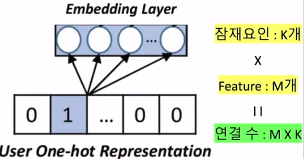

# 👍Section 06_ 딥러닝을 사용한 추천 시스템[↩](../../)

## contents📑<a id='contents'></a>

* 0_ 들어가기 전에[✏️](#0)
* 1_ Maxtrix Factorization(MF)을 신경망으로 변환하기[✏️](#0)

## 0_ 들어가기 전에[📑](#contents)<a id='0'></a>

* 딥러닝(Deep Learning : DL)은 다수의 은닉층(hidden layer)을 가진 인공신경망을 적용한 기법

## 1_ Maxtrix Factorization(MF)을 신경망으로 변환하기[📑](#contents)<a id='1'></a>


* `MF`를 `Keras`로
* input layer : 각 사용자와 item으로 부터 입력을 받는 부분
  * one-hot representation : 원핫인코딩과 같음. 1인지 0인지를 binary한 형태로 바꿔줌. 
* 사용자의 One-Hot Represention 입력

|        | feature 1 | feature 2 | feature 3 | ...  | feature M |
| ------ | --------- | --------- | --------- | ---- | --------- |
| User 1 | 1         | 0         | 0         | 0    | 0         |
| User 2 | 0         | 1         | 0         | 0    | 0         |
| User 3 | 0         | 0         | 1         | 0    | 0         |
| ...    | 0         | 0         | 0         | 1    | 0         |
| User M | 0         | 0         | 0         | 0    | 1         |

* embedding Layer : 잠재요인 K를 규정

  

  * 사용자 노드에 모두 연결됨. 즉, 화살표가 갯수가 M*K개가 연결되어 있음. 
  * 한 사용자당 K개의 화살표가 있음.
  * 만약 item이면 N* K가 연결되어 있음.

* MP : P(M * K)와 Q(N * K)가 연결됨. 

* Element-wise Product Layer

  

  * 사용자와 아이템의 각 프로덕트 연산을 위한 layer
  * P * Q<sup>T</sup>

* 사용자와 아이템의 평가경향(bias)

  

* 총 정리

  

  1. 사용자 아이템 두가지의 원핫 레프리젠테이션을 진행함.
  2. 사용자 입력은 K개의 노드를 갖는 유저, 아이템 임베딩과 연결
  3. 유저 임베딩과 아이템 임베딩은 DOT프로덕트연산으로 연결
  4. 다시 입력으로 돌아와 1개의 사용자가 각각 아이템 평가 경향, 유저 평가 경향 임베딩과 연결됨.
  5. 마지막으로 유저평가 경향 임베딩, 아이템 평가 경향임베딩, DOT 이 결함됨. 
  6. Flattten은 차원을 줄여주는 역할을 함. 

* 위에서 BU와 BD는 구현을 했는데. B(상수)를 구현하진 못함.

  * 전체 평균을 일률적으로 빼서 편성하게 됨. 

## 2_ Keras로 MF 구현하기[📑](#contents)<a id='2'></a>

* 파일 불러오기

  ```python
  # csv 파일에서 불러오기
  import  pandas as pd
  
  # train set과 test set을 나누기 위한 라이브러리
  from sklearn.model_selection import train_test_split
  
  # 필요한 tensorflow 모듈들을 가져온다.
  import tensorflow as tf
  from tensorflow.keras import layers
  from tensorflow.keras.models import Model
  from tensorflow.keras.layers import Input, Embedding, Dot, Add, Flatten
  from tensorflow.keras.regularizers import l2
  from tensorflow.keras.optimizers import SGD, Adamax
  
  # DataFrame 형태로 데이터를 읽어온다.
  r_cols = ['user_id', 'movie_id', 'rating', 'timestamp']
  ratings = pd.read_csv('./Data/u.data',
                          names=r_cols,
                          sep='\t',
                          encoding='latin-1')
  
  ratings_train, ratings_test = train_test_split(ratings,
                                                  test_size=0.2,
                                                  shuffle=True,
                                                  random_state=2021)
  ```

* 데이터 설정

  ```python
  K = 200
  
  mu = ratings_train.rating.mean()
  
  M = ratings.user_id.max() + 1
  N = ratings.movie_id.max() + 1      # bias_com의 크기 1을 감안하는 것!
  
  def RMSE(y_true, y_pred):
      return tf.sqrt(tf.reduce_mean(tf.square(y_true - y_pred)))
  ```

* P, Q 사용자 평가 경향 임베딩

  ```python
  user = Input(shape=(1,))
  item = Input(shape=(1,))
  
  P_embedding = Embedding(M, K, embeddings_regularizer=l2())(user)
  Q_embedding = Embedding(N, K, embeddings_regularizer=l2())(item)
  
  user_bias = Embedding(M, 1, embeddings_regularizer=l2())(user)
  item_bias = Embedding(N, 1, embeddings_regularizer=l2())(item)
  ```

* 요약 출력

  ```python
  R = layers.dot([P_embedding, Q_embedding], axes=(2,2))
  
  R = layers.add([R, user_bias, item_bias])
  
  R = Flatten()(R)
  
  model = Model(inputs=[user, item], outputs=R)
  model.compile(
      loss=RMSE,
      optimizer=SGD(),
      metrics=[RMSE]
  )
  
  model.summary()
  
  # 실행 결과
  Model: "model"
  __________________________________________________________________________________________________
  Layer (type)                    Output Shape         Param #     Connected to                     
  ==================================================================================================
  input_3 (InputLayer)            [(None, 1)]          0                                            
  __________________________________________________________________________________________________
  input_4 (InputLayer)            [(None, 1)]          0                                            
  __________________________________________________________________________________________________
  embedding (Embedding)           (None, 1, 200)       188800      input_3[0][0]                    
  __________________________________________________________________________________________________
  embedding_1 (Embedding)         (None, 1, 200)       336600      input_4[0][0]                    
  __________________________________________________________________________________________________
  dot (Dot)                       (None, 1, 1)         0           embedding[0][0]                  
                                                                   embedding_1[0][0]                
  __________________________________________________________________________________________________
  embedding_2 (Embedding)         (None, 1, 1)         944         input_3[0][0]                    
  __________________________________________________________________________________________________
  embedding_3 (Embedding)         (None, 1, 1)         1683        input_4[0][0]                    
  __________________________________________________________________________________________________
  add (Add)                       (None, 1, 1)         0           dot[0][0]                        
                                                                   embedding_2[0][0]                
                                                                   embedding_3[0][0]                
  __________________________________________________________________________________________________
  flatten (Flatten)               (None, 1)            0           add[0][0]                        
  ==================================================================================================
  Total params: 528,027
  Trainable params: 528,027
  Non-trainable params: 0
  __________________________________________________________________________________________________
  
  ```

  
