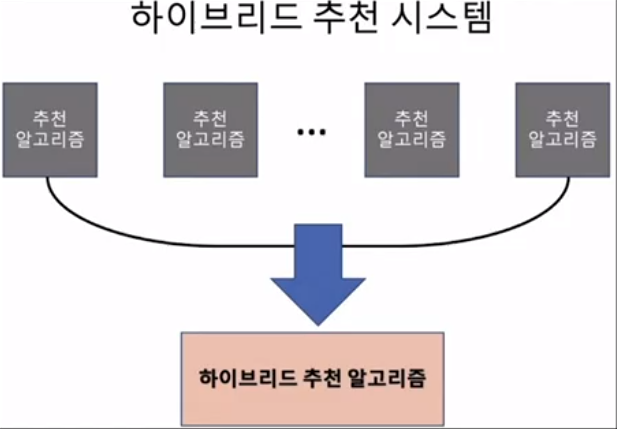
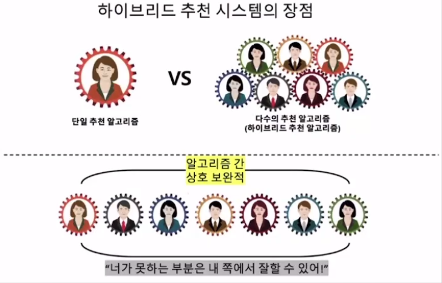

# 👍Section 07_ 하이브리드 추천 시스템[↩](../../)

## contents📑<a id='contents'></a>

* 0_ 들어가기 전에[✏️](#0)
* 1_ 하이브리드 추천 시스템의 장점
* 2_ 하이브리드 추천 시스템의 원리
* 3_ 하이브리드 추천 시스템(CF와 MF의 결합)

## 0_ 들어가기 전에[📑](#contents)<a id='0'></a>



## 1_ 하이브리드 추천 시스템의 장점[📑](#contents)<a id='1'></a>



## 2_ 하이브리드 추천 시스템의 원리[📑](#contents)<a id='2'></a>

```python
from sklearn.model_selection import train_test_split
import random
import numpy as np
import pandas as pd

r_cols = ["user_id","movie_id",'rating','timestamp']
ratings = pd.read_csv('./Data/u.data',
                    sep = '\t',
                    names = r_cols,
                    encoding='latin-1')

ratings_train, ratings_test = train_test_split(ratings, 
                                               test_size = 0.2,
                                               shuffle = True,
                                               random_state = 2021)

def RMSE2(y_true, y_pred):
  return np.sqrt(np.mean((np.array(y_true)-np.array(y_pred))**2))

#2개의 더미 추천 엔진 
def recommender_1(recom_list):      #추천해야할 리스트를 받아오고 
  recommendations = [] #예측치 저장 
  for pair in recom_list: 
    recommendations.append(random.random() * 4 + 1) # 1~5사이의 난수 발생 
  return np.array(recommendations)

def recommender_2(recom_list): 
  recommendations = [] #예측치 저장 
  for pair in recom_list: 
    recommendations.append(random.random() * 4 + 1) #1~5사이의 난수 발생 
  return np.array(recommendations)

weight = [0.8, 0.2] #결합 비중 
recom_list = np.array(ratings_test)
predictions_1 = recommender_1(recom_list)
predictions_2 = recommender_2(recom_list)

predictions = predictions_1 * weight[0] + predictions_2 * weight[1] # 두 추천엔진의 예측값을 가중치 처리함.
RMSE2(recom_list[:,2], predictions)

# 실행 결과
1.5707050630820683
```

## 3_ 하이브리드 추천 시스템(CF와 MF의 결합)[📑](#contents)<a id='3'></a>

