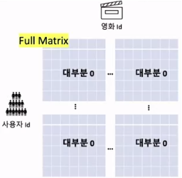
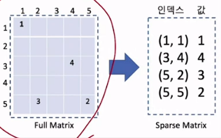
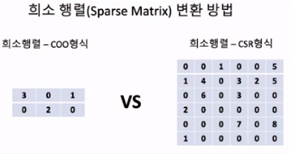

# 👍Section 08_ 대규모 데이터의 처리를 위한 Sparse Matrix 사용[↩](../../)

## contents📑<a id='contents'></a>

* 0_ 들어가기 전에[✏️](#0)
* 1_ Sparse Matrix의 개념과 Python에서의 사용[✏️](#1)
* 2_Sparse Matrix를 추천 알고리즘에 적용하기[✏️](#2)

## 0_ 들어가기 전에[📑](#contents)<a id='0'></a>


* `movie_lens` 데이터셋을 `full matrix`로 이용하기는 어려움



* 대부분 0인 `sparse matrix`임.



* 25개 에서 4개의 요소로 12개를 표현함
* 그러나 희소행렬을 사용하게 되면 데이터 처리에 대한 Overhead Cost(간접비)가 커짐 : 배보다 배꼽이 더 커질 수 있음. 따라서 데이터가 진짜 클 때만 이용하면 좋음.
* `python`의 경우에는 `scipy`를 이용하면 됨. 

## 1_ Sparse Matrix의 개념과 Python에서의 사용[📑](#contents)<a id='1'></a>



* COO(Coordinate :좌표) 형식
  * 값 : [3, 1, 2]
  * 행 : [0, 2, 1]
  * 열 : [0, 0, 1]
* CSR(Compressed Sparse Row)형식 : COO형식의 비효율성을 개선함.
  * 값 : [1 5 1 4 3 2 5 6 3 2 7 8 1]
  * 행 : [0 0 1 1 1 1 1 2 2 3 4 4 5] → [0 2 3 7 9 10 12 13]
  * 열 : [2 5 0 1 3 4 5 1 3 0 3 5 0]
  * 살짝 비효율적임을 볼 수 있음. -> 행에 중복값이 나타나는 모습을 볼 수 있음.
  * 낭비를 줄여야!

* full matrix 구현

  ```python
  import numpy as np
  import pandas as pd
  #sparse matrix를 사용하기 위한 scipy 라이브러리 
  from scipy.sparse import csr_matrix 
  
  #간단한 테스트를 위한 임시 데이터
  ratings = {'user_id' : [1, 2, 4],
             'movie_id':[2, 3, 7],
             'rating' : [4, 3, 1]}
  ratings = pd.DataFrame(ratings)
  
  #Pandas pivot을 이용해서 full matrix 변환
  #일반적인 DataFrame의 pivot 기능을 사용해서 full matrix 변환
  rating_matrix = ratings.pivot(index = 'user_id',
                                columns = 'movie_id',
                                values = 'rating').fillna(0)
        
  full_matrix1 = np.array(rating_matrix)
  print(full_matrix1)
  
  # 실행 결과
  [[4. 0. 0.]
   [0. 3. 0.]
   [0. 0. 1.]]
  
  rating_matrix
  # 실행 결과
  movie_id	2	3	7
  user_id			
  1	4.0	0.0	0.0
  2	0.0	3.0	0.0
  4	0.0	0.0	1.0
  ```

* sparse matrix 구현

  ```python
  #Sparse matrix를 이용해서 full matrix 변환
  #원소의 값(평점) 지정 
  data = np.array(ratings['rating'])
  #row 인덱스 지정 
  row_indices = np.array(ratings['user_id'])
  #column 인덱스 지정
  col_indices = np.array(ratings['movie_id'])
  #원래 데이터를 아까 설명했던 csr_matrix로 변환 
  rating_matrix = csr_matrix((data,(row_indices, col_indices)),dtype=int)
  print(rating_matrix)
  
  # 실행 결과
  (1, 2)	4
  (2, 3)	3
  (4, 7)	1
  
  rating_matrix[1, 2]
  # 실행 결과
  4
  
  full_matrix2 = rating_matrix.toarray()
  print(full_matrix2)
  # 실행 결과
  [[0 0 0 0 0 0 0 0]
   [0 0 4 0 0 0 0 0]
   [0 0 0 3 0 0 0 0]
   [0 0 0 0 0 0 0 0]
   [0 0 0 0 0 0 0 1]]
  ```

## 2_ Sparse Matrix를 추천 알고리즘에 적용하기[📑](#contents)<a id='2'></a>

* `python`에서 대용량 데이터를 불러올 경우

  ```python
  from sklearn.model_selection import train_test_split
  import random
  import numpy as np
  import pandas as pd
  import os 
  
  base_src = './Data'
  ratings_20m_src = os.path.join(base_src, 'ratings-20m.csv')
  r_cols = ["user_id","movie_id",'rating','timestamp']
  #20M data 읽어오기 
  ratings = pd.read_csv(ratings_20m_src,
                      sep = ',',
                      names = r_cols,
                      encoding='latin-1')
  
  R_temp = ratings.pivot(index='user_id', columns = 'movie_id', values = 'rating').fillna(0)
  
  # 실행 결과
  ---------------------------------------------------------------------------
  ValueError                                Traceback (most recent call last)
  <ipython-input-1-d276daa88f26> in <module>
       16                     encoding='latin-1')
       17 
  ---> 18 R_temp = ratings.pivot(index='user_id', columns = 'movie_id', values = 'rating').fillna(0)
  
  C:\Python\Python36\lib\site-packages\pandas\core\frame.py in pivot(self, index, columns, values)
     6676         from pandas.core.reshape.pivot import pivot
     6677 
  -> 6678         return pivot(self, index=index, columns=columns, values=values)
     6679 
     6680     _shared_docs[
  
  C:\Python\Python36\lib\site-packages\pandas\core\reshape\pivot.py in pivot(data, index, columns, values)
      475         else:
      476             indexed = data._constructor_sliced(data[values]._values, index=index)
  --> 477     return indexed.unstack(columns)
      478 
      479 
  
  C:\Python\Python36\lib\site-packages\pandas\core\series.py in unstack(self, level, fill_value)
     3901         from pandas.core.reshape.reshape import unstack
     3902 
  -> 3903         return unstack(self, level, fill_value)
     3904 
     3905     # ----------------------------------------------------------------------
  
  C:\Python\Python36\lib\site-packages\pandas\core\reshape\reshape.py in unstack(obj, level, fill_value)
      423             return _unstack_extension_series(obj, level, fill_value)
      424         unstacker = _Unstacker(
  --> 425             obj.index, level=level, constructor=obj._constructor_expanddim,
      426         )
      427         return unstacker.get_result(
  
  C:\Python\Python36\lib\site-packages\pandas\core\reshape\reshape.py in __init__(self, index, level, constructor)
      116 
      117         if num_rows > 0 and num_columns > 0 and num_cells <= 0:
  --> 118             raise ValueError("Unstacked DataFrame is too big, causing int32 overflow")
      119 
      120         self._make_selectors()
  
  ValueError: Unstacked DataFrame is too big, causing int32 overflow
  ```

  * 데이터프레임이 너무 크다고 오류가 나옴.

* `sparse matrix` 사용

  ```python
  #Sparse Matrix 사용을 위한 라이브러리 
  from scipy.sparse import csr_matrix 
  from sklearn.model_selection import train_test_split
  import random
  import numpy as np
  import pandas as pd
  import os 
  
  base_src = './Data'
  ratings_20m_src = os.path.join(base_src, 'ratings-20m.csv')
  r_cols = ["user_id","movie_id",'rating','timestamp']
  #20M data 읽어오기 
  ratings = pd.read_csv(ratings_20m_src,
                      sep = ',',
                      names = r_cols,
                      encoding='latin-1')
  ratings = ratings[['user_id','movie_id','rating']].astype(int)
  
  #데이터 지정 
  data = np.array(ratings['rating'])
  #row 인덱스 저장 
  row_indices = np.array(ratings['user_id'])
  #column 인덱스 지정
  col_indices = np.array(ratings['movie_id'])
  #csr_matrix 형식으로 데이터를 변환해서 ratings에 저장한다. 
  R_temp = csr_matrix((data,(row_indices, col_indices)),dtype=int)
  
  class NEW_MF(): 
    def __init__(self, ratings, hyper_params): 
      self.R = ratings
      #사용자 수(num_users)와 아이템 수(num_iterms)를 받아온다.
      self.num_users, self.num_items = np.shape(self.R)
      #아래는 MF weight 조절을 위한 하이퍼파라미터이다. 
      #K : 잠재요인의 수 
      self.K = hyper_params['K'] #key값 
      self.alpha = hyper_params['alpha'] #학습률
      self.beta = hyper_params['beta'] #정규화 계수 
      self.iterations = hyper_params['iterations'] #반복 횟수
      self.verbose = hyper_params['verbose'] #학습과정 출력 여부 결정 
    
    def rmse(self):
      #rating data에서 0이 아닌 요소의 인덱스
      xs, ys = self.R.nonzero() 
      #prediction과 error를 담을 리스트 변수 초기화 
      self.predictions = []
      self.errors = [] 
      #평점이 있는 요소(사용자 x, 아이템 y) 각각에 대해서 아래의 코드를 실행한다. 
      for x,y in zip(xs, ys): 
        #사용자 x, 아이템 y에 대해서 평점 예측치를 get_predition() 함수를 사용해서 계산한다.
        prediction = self.get_prediction(x,y)
        #예측값을 예측값 리스트에 추가한다.
        self.predictions.append(prediction)
        #실제값(R)과 예측값의 차이(errors) 계산해서 오차값 리스트에 추가한다.
        self.errors.append(self.R[x,y]-prediction)
      #예측값 리스트와 오차값 리스트를 numpy array형태로 변환한다.
      self.predictions = np.array(self.predictions)
      #error를 활용해서 RMSE 도출 
      self.errors = np.array(self.errors)
      return np.sqrt(np.mean(self.errors**2))
  
    def get_prediction(self, i, j): 
      #사용자 i, 아이템 j에 대한 평점 예측치를 앞에서 배웠던 식을 이용해서 구한다.
      prediction = self.b + self.b_u[i] + self.b_d[j] + self.P[i,:].dot(self.Q[j,].T) #전체 평점 + 유저에 대한 평가 경항 + 아이템에 대한 평가 경향 + 사용자 요인값*아이템 요인값
      return prediction 
  
    def sgd(self): 
      for i,j,r in self.samples:  #i,j : 인덱스, r : 평점 
        #사용자 i, 아이템 j에 대한 평점 예측치 계산 
        prediction = self.get_prediction(i,j)
        #실제 평점과 비교한 오차 계산 
        e = (r-prediction)
        
        #사용자 평가 경향 계산 및 업데이트
        self.b_u[i] += self.alpha * (e - (self.beta * self.b_u[i]))
        #아이템 평가 경향 계산 및 업데이트
        self.b_d[j] += self.alpha * (e- (self.beta * self.b_d[j]))
  
        #P 행렬 계산 및 업데이트
        self.P[i,:] += self.alpha * ((e * self.Q[j,:] - self.beta * self.P[i,:]))
        #Q 행렬 계산 및 업데이트
        self.Q[j,:] += self.alpha * ((e * self.P[i,:])- (self.beta * self.Q[j, :]))
  
    #Test set 선정 
    def set_test(self, ratings_test):
      test_set = []
      for i in range(len(ratings_test)):
        x,y,z = ratings_test.iloc[i]
        self.R[x,y] = 0 #평점 0으로 만들기 
      self.test_set = test_set 
      return test_set 
  
    #Test set RMSE 계산 
    def test_rmse(self):
      error = 0
      for one_set in self.test_set: 
        predicted = self.get_prediction(one_set[0],one_set[1])
        #pow : 차승 
        error += pow(one_set[2]-predicted, 2)
      return np.sqrt(error/len(self.test_set))
  
    def test(self): #학습 
      self.P = np.random.normal(scale=1./self.K,
                                size = (self.num_users, self.K))
      self.Q = np.random.normal(scale=1./self.K,
                                size = (self.num_items, self.K))
      self.b_u = np.zeros(self.num_users)
      self.b_d = np.zeros(self.num_items)
      self.b = np.mean(self.R[self.R.nonzero()])
  
      rows, columns = self.R.nonzero() 
      self.samples = [(i,j,self.R[i,j]) for i,j in zip(rows, columns)]
  
      training_process = []
      for i in range(self.iterations):
        np.random.shuffle(self.samples)
        self.sgd() #weight 값 업데이트 
        rmse1 = self.rmse() #training set
        rmse2 = self.test_rmse() #test set
        training_process.append((i+1, rmse1, rmse2))
        if self.verbose == True:
          if (i+1) % 10 == 0:
            print("Iteration : %d ; train RMSE = %.4f; test RMSE %.4f"%(i+1, rmse1, rmse2))
      return training_process 
  
    def get_one_prediction(self, user_id, item_id): #하나 예측 
      return self.get_prediction(user_id, item_id)
    
    def full_prediction(self): #전체 예측 
      return self.b + self.b_u[:, np.newaxis] + self.b_d[np.newaxis, :] + self.P.dot(self.Q.T)
  
  ratings_train, ratings_test = train_test_split(ratings, 
                                                 test_size = 0.2,
                                                 shuffle = True,
                                                 random_state = 2021)
        
  hyper_params = {
      'K' : 30,
      'alpha':0.001,
      'beta':0.02,
      'iterations':100,
      'verbose':True
  }
  
  mf = NEW_MF(R_temp, hyper_params)
  test_set = mf.set_test(ratings_test) #일부분은 test로 지정 
  result = mf.test()
  ```

* 큰 데이터를 `sparse matrix`를 활용하여 `numpy.array()`를 사용했다면 불가능 했을 것을 가능하게 함.
