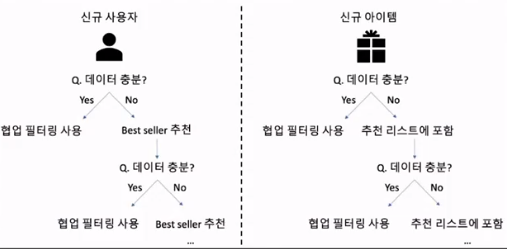
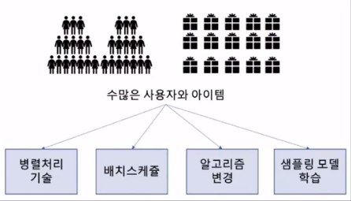
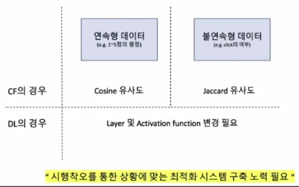
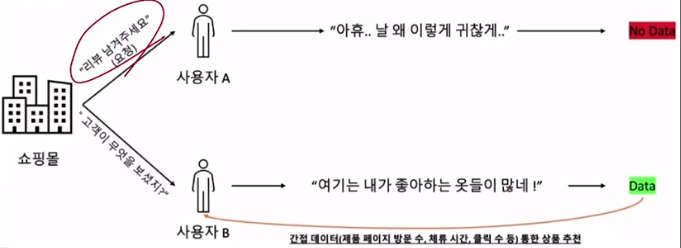

# 👍Section 09_ 추천 시스템 구축에서의 이슈[↩](../../)

## contents📑

* 0_ 들어가기 전에[✏️](#0)
* 1_ 신규 사용자와 아이템(Cold Start Problem)[✏️](#1)
* 2_ 확장성(Scalability)[✏️](#2)
* 3_ 추천의 활용(Presentation)[✏️](#3)
* 4_ 이진수 데이터(Binary Data)의 사용[✏️](#4)
* 5_ 사용자의 간접 평가 데이터(Indirect Evaluation Data) 확보[✏️](#5)

## 0_ 들어가기 전에[📑](#contents)

* 이번 장에서는 실제 추천시스템 구축 시 고려사항을 이야기 해보고자 한다.

## 1_ 신규 사용자와 아이템(Cold Start Problem)[📑](#contents)

* `빈익빈 부익부` 현상이 나타날 수 있는데 이처럼 하면 줄일 수 있음. 

## 2_ 확장성(Scalability)[📑](#contents)

* 사용자별 추천 리스트에 대한 배치 방식으로 또 사용자들이 별로 없는 동안에...!
* 효율적 계산
* 너무 모든 사용자를 모두 사용하기 보다는 서비스를 대표할 수 있는 사용자를 뽑아서 샘플링을 할 수 있음. 

## 3_ 추천의 활용(Presentation)[📑](#contents)

| 직접적 추천 리스트 제공 | 간접적 추천 리스트 제공 | 검색 결과 정렬 | 맞춤형 광고 제공 | 등등 |
| :---------------------: | :---------------------: | :------------: | :--------------: | :--: |

## 4_ 이진수 데이터(Binary Data)의 사용[📑](#contents)

추천시스템을 각자 현업에 바로 적용하기는 힘듦. 시행착오를 통해서 도메인에 최적화된 좋은 추천 알고리즘을 만들 수 있음.

## 5_ 사용자의 간접 평가 데이터(Indirect Evaluation Data) 확보[📑](#contents)

* 사용자의 암묵적인 선언 데이터 → 간접 데이터
